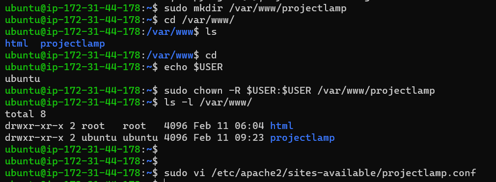
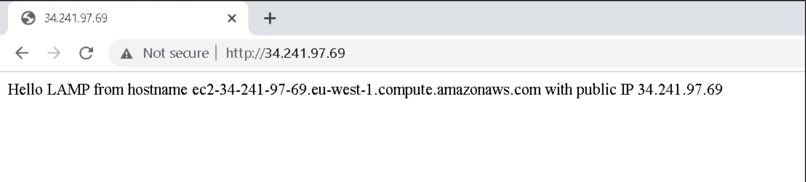

# Project 1 - LAMP Stack Implementation

## Step 1 - Installing Apache and Updating The Firewall
- Update a list of packages in package manager

`$ sudo apt update`

- Run apache2 package installation

`$ sudo apt install apache2`

- Verify that apache2 service is running successfully

`$ sudo systemctl status apache2`


- Modify security group and allow TCP port 80 inbound rule


- Verify using curl
	- Apache accessible locally
	
	`$ curl http://localhost:80`

	
	- Apache accessible using Public IP

	
	- Using the browser


## Step 2 - Installing MySQL
- Install MySQL

`$ sudo apt install mysql-server`

- Run security script to remove some insecure default settings and lock down access to the database system

`$ sudo mysql_secure_installation`


- Access MySQL

`$ sudo mysql`


## Step 3 - Installing PHP
- Install PHP

`$ sudo apt install php libapache2-mod-php php-mysql -y`

`$ php -v`


**LAMP stack has been installed completely and it is operational**

## Step 4 - Creating a Virtual Host for Your Website using Apache
- Create the directory for domain - projectlamp

`$ sudo mkdir /var/www/projectlamp`

- Assign ownership of the directory with current system user

`$ sudo chown -R $USER:$USER /var/www/projectlamp`

- Create and open a new configuration file in Apache’s sites-available directory using "vi" command-line editor

`$ sudo vi /etc/apache2/sites-available/projectlamp.conf`




- Enabled the new virtualhost created with the command below:

`$ sudo a2ensite projectlamp`

- Disable the default website that comes installed with Apache using the command:

`$ sudo dissite 000-default`

- Run the command to make sure the config file does not contain any syntax error

`$ sudo apache2ctl configtest`

- Reload Apache so the changes can take effect

`$ sudo systemctl reload apache2`

- Create an index.html file in the /var/www/projectlamp directory for testing if the virtual host works fine
```
sudo echo 'Hello LAMP from hostname' $(curl -s http://169.254.169.254/latest/meta-data/public-hostname) 'with public IP' 
$(curl -s http://169.254.169.254/latest/meta-data/public-ipv4) > /var/www/projectlamp/index.html
```

The below screen shot captures the commands run above




## Step 5 - Enable PHP on the Website
- Modify Apache precedence for php files

`$ sudo vim /etc/apache2/mods-enabled/dir.conf`

As shown in the screenshot below:


- Create a new file named index.php inside your custom web root folder and 

`$ vim /var/www/projectlamp/index.php`

- Enter the following lines and save:
```
<?php
phpinfo();
```
- Reload apache for changes to take effect

`$ sudo systemctl reload apache2`


- Reload page to show PHP installation working as expected

