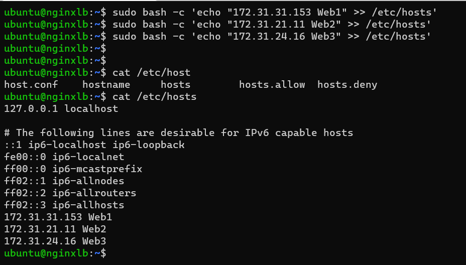
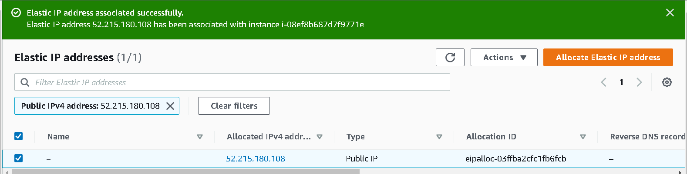
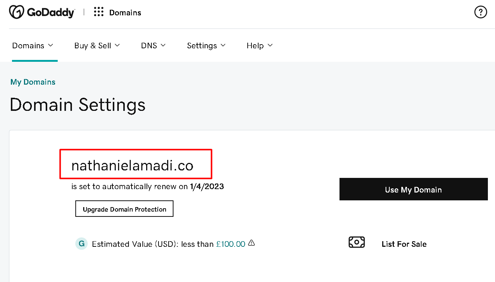
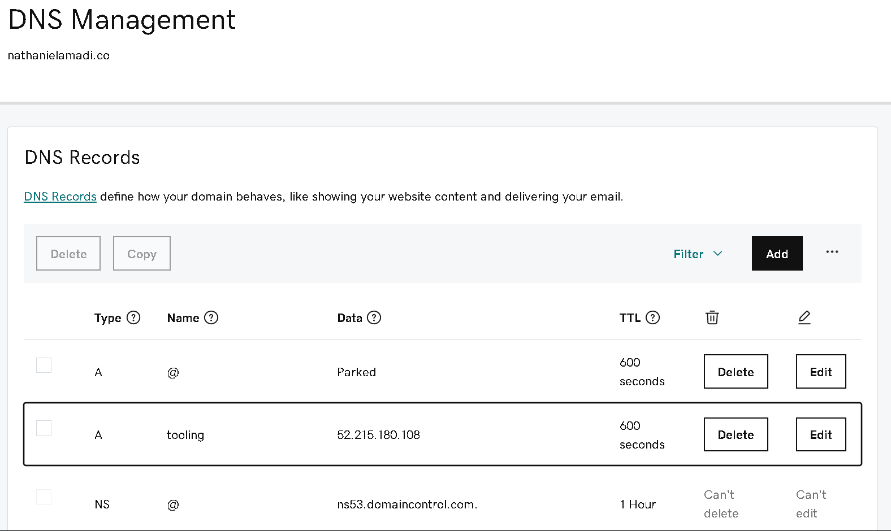
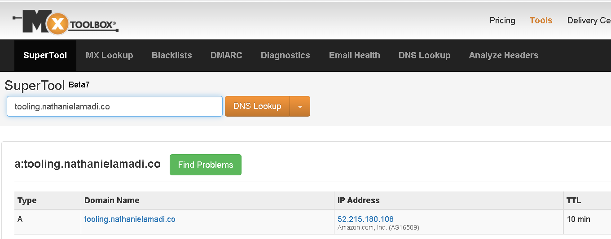
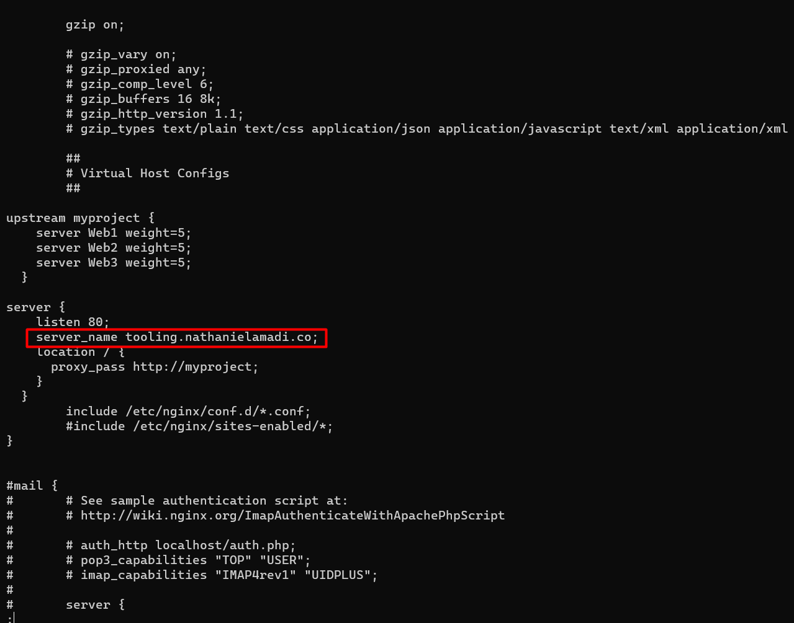
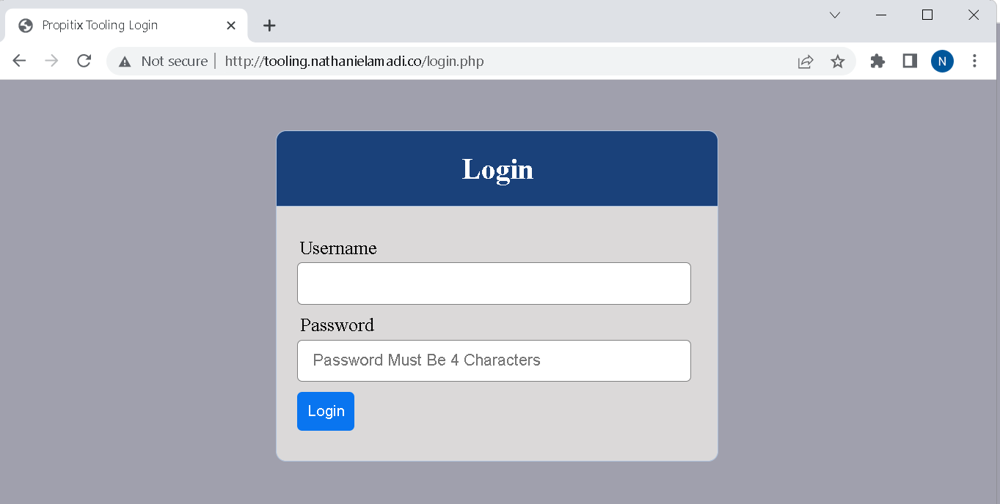
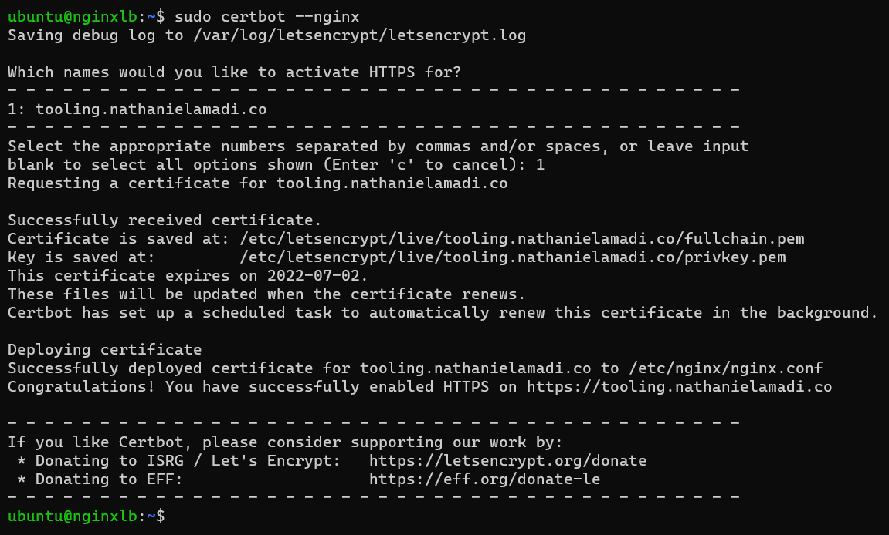
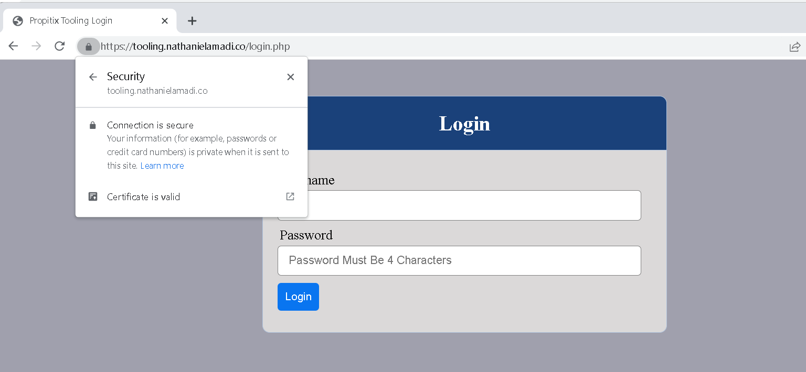
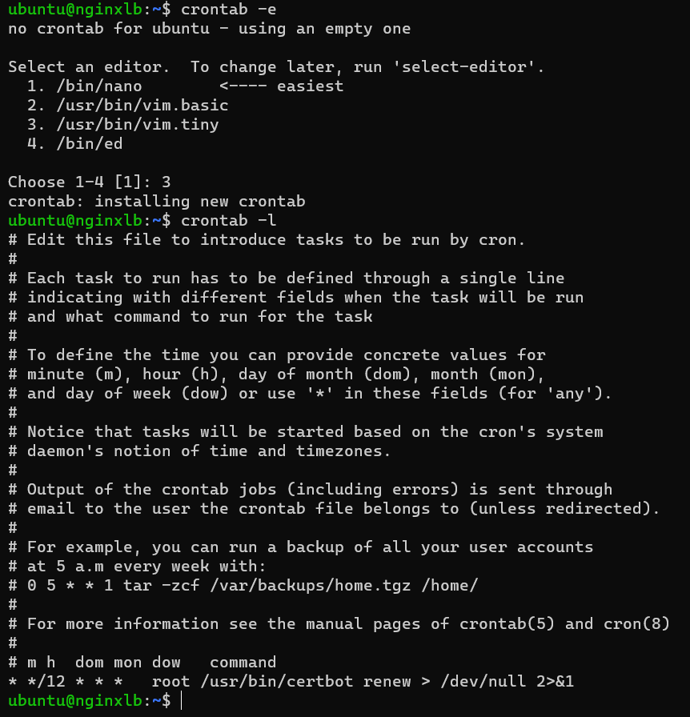

# Project 10 - Load Balancer Solution With Nginx and SSL/TLS

## Architecture
In this project, we are utilizing the servers implemented in [Project 7](../Project-7/project7.md and including a load balancer solution using Nginx

## Step 1 - Launch the Nginx server
- Launch a new ec2 instance and open ports 80 for HTTP and 443 for HTTPS

- Change the hostname
``` shell
sudo hostnamectl set-hostname nginx_lb
bash
```

- Update the server and Install Nginx
```
sudo apt update
sudo apt install nginx
```

- Update the hosts file with the Webservers IP address
``` shell
sudo bash -c 'echo "172.31.31.153 Web1" >> /etc/hosts'
sudo bash -c 'echo "172.31.21.11 Web2" >> /etc/hosts'
sudo bash -c 'echo "172.31.24.16 Web3" >> /etc/hosts'
```



- Associate Elastic IP to the Nginx Load balancer server




## Step 2 - Purchase and Configure a Domain
- Purchase a new domain or use an existing one (if any)



- Point Domain's A record to the Elastic IP address of the Nginx server



- Verify that DNS is propagated



- Update the nginx conf file with the Webservers hostname and domain name
```,shell
sudo vi /etc/nginx/nginx.conf

#insert following configuration into http section

 upstream myproject {
    server Web1 weight=5;
    server Web2 weight=5;
	server Web3 weight=5;
  }

server {
    listen 80;
    server_name tooling.nathanielamadi.co;
    location / {
      proxy_pass http://myproject;
    }
  }

#comment out this line
#       include /etc/nginx/sites-enabled/*;
```


- Restart Nginx and make sure the service is up and running
``` shell
sudo systemctl restart nginx
sudo systemctl status nginx
```
- Verify that site is reachable with the Domain name



## Step 3 - Setup SSL/TLS on the domain via Certbot
- Install Certbot
``` shell
# verify that snapd is installed
sudo systemctl status snapd

# install certbot
sudo snap install --classic certbot
sudo ln -s /snap/bin/certbot /usr/bin/certbot
```

- Initiate certbot and select the domain to be configured for ssl
``` shell
sudo certbot --nginx
```


- Verify that the ssl certificate files were added to the nginx conf file 


- Verify site is accessible on https



## Step 4 - Set up a Job scheduler to renew the certbot
- Set a cron job scheduler to renew the certbot on 12 hours basis
```
crontab -e

* */12 * * *   root /usr/bin/certbot renew > /dev/null 2>&1
```

- Verify the vcrontab settings
```
crontab -l
```


