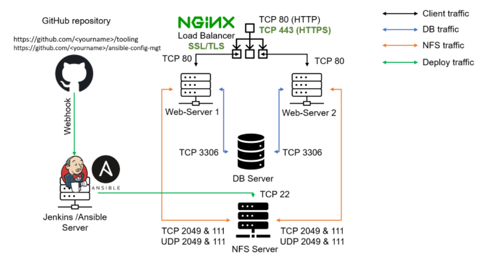
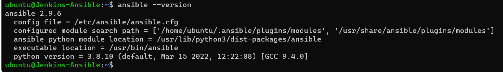
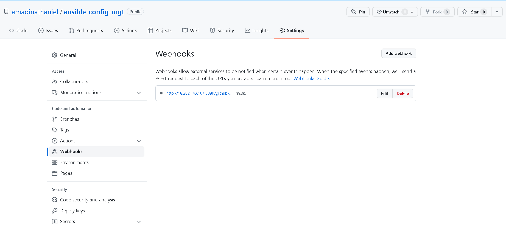
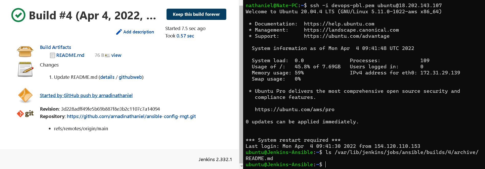
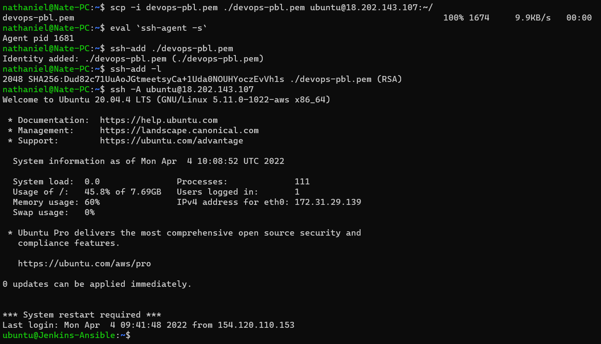
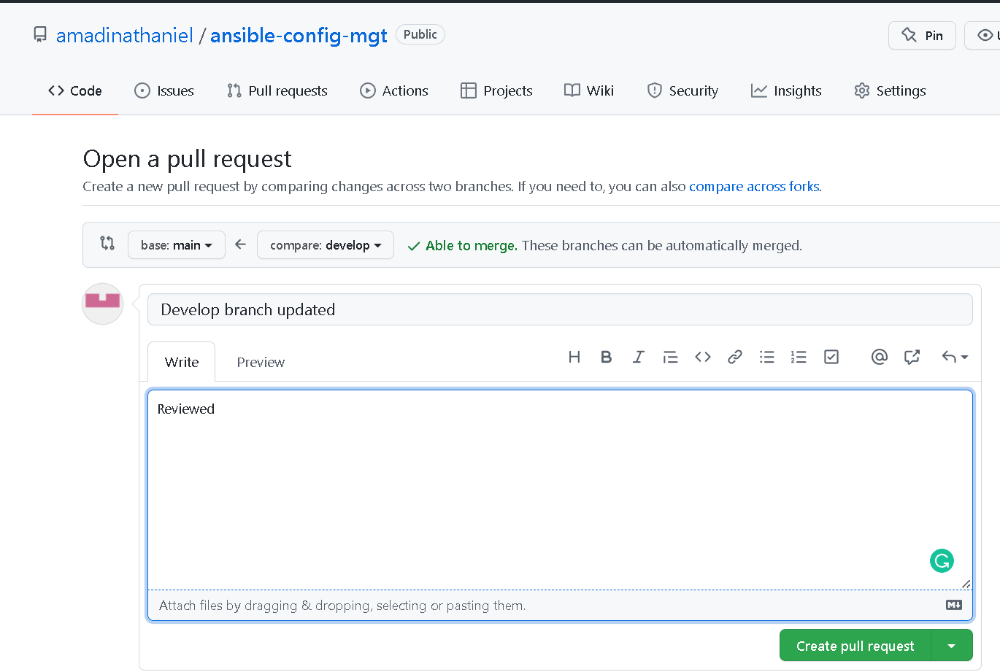
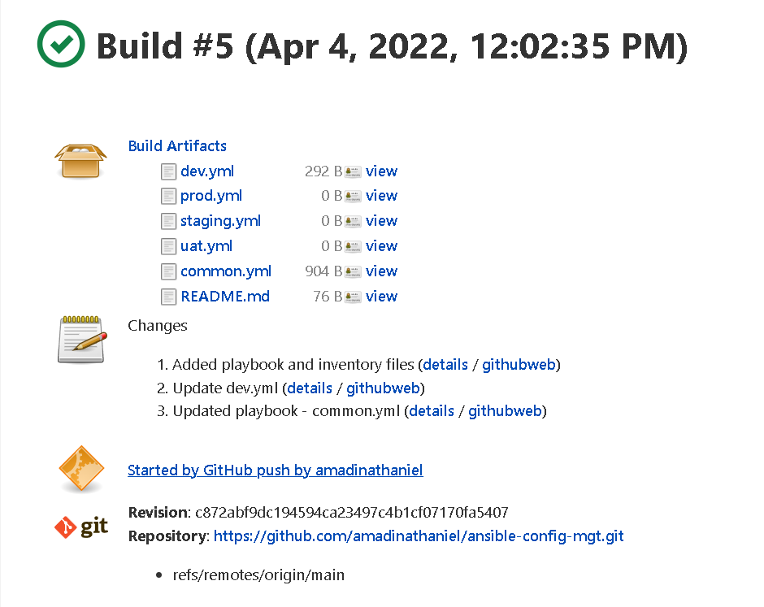
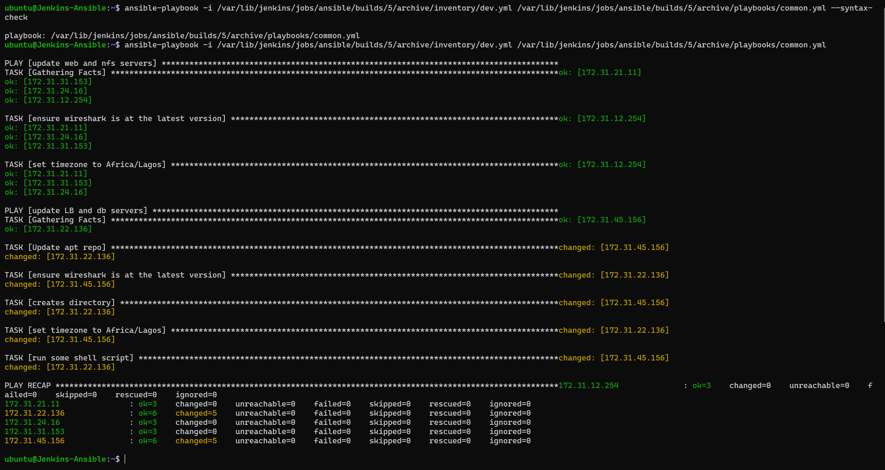
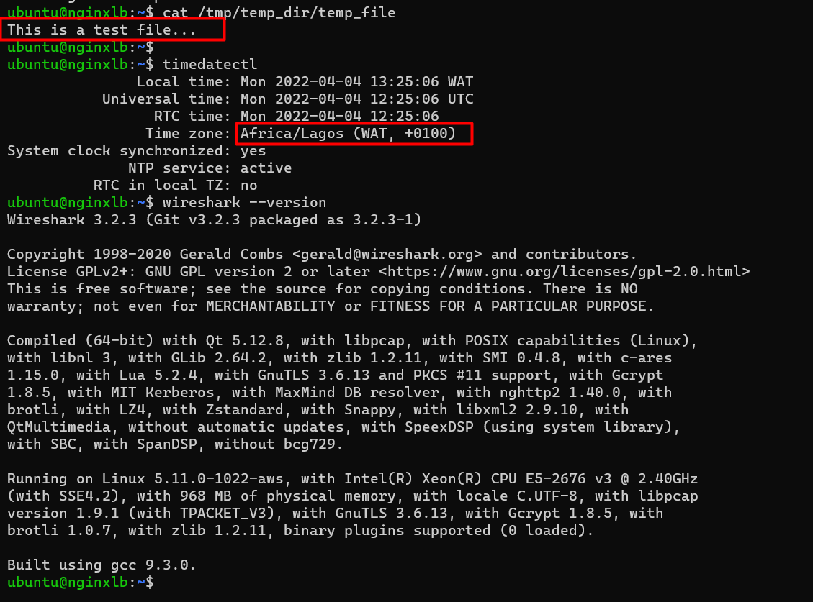
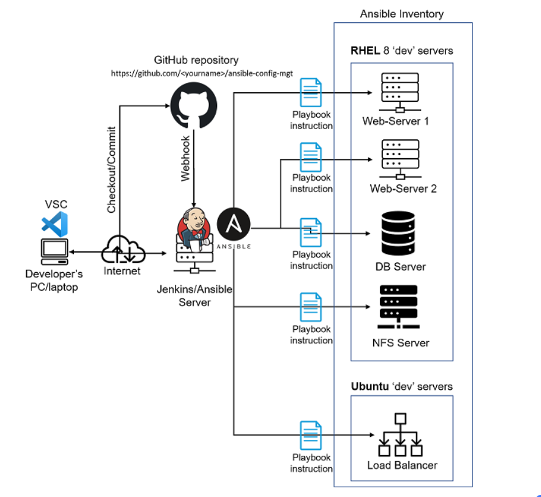

# Project11 - Ansible – Automate Project 7 to 10

## Architecture
- In this project, we are utilizing the Jenkins server implemented in [Project 9](../Project-7/project7.md) and configuring an Ansible Playbook to deploy to the target servers.



## Step 1 Install Ansible on the EC2 instance
- Update Name tag on your `Jenkins` EC2 Instance to `Jenkins-Ansible`. We will use this server to run playbooks.

- Install Ansible
``` shell
sudo hostnamectl set-hostname Jenkins-Ansible
bash

sudo apt update -y
sudo apt install ansible -y

ansible --version
```


## Step 2 - Setup the Git repository
- Create the Github Repository with the name `ansible-config-mgt` and set the webhook



- Create a new Freestyle project `ansible` in Jenkins and point it to the ‘ansible-config-mgt’ repository.

- Configure Jenkins build job to save repository content every time you change it

- Clone the git repository and push some codes
``` shell
# Clone the repo
git clone https://github.com/stwalez/ansible-config-mgt.git

# create a new branch that will be used for development of a new feature.
git checkout -b develop
```

- Create the directories and files
```
mkdir playbooks
mkdir inventory

touch playbooks/common.yml
touch inventory/{dev,staging,uat,prod}.yml
```

- Push the codes
``` shell
git add .
git commit -m "Added inventory and playbook files"
git push --set-upstream origin develop

```

- Verify webhook works
```
ls /var/lib/jenkins/jobs/ansible/builds/<build_number>/archive/
```


## Step 3 - Begin Ansible Development
- Copy the ssh private key of the targets to the Jenkins-Ansible server
``` shell
scp -i devops-pbl.pem ./devops-pbl.pem ubuntu@18.202.143.107:~/
```

- Set up ssh agent to connect to Jenkins-Ansible server without the identity file option. 
Do the same for the Jenkins Ansible server to connect to the target servers.
``` shell
eval `ssh-agent -s`
ssh-add ./devops-pbl
```


- Update inventory/dev.yml file:
``` yaml
[nfs]
172.31.12.254 ansible_ssh_user='ec2-user'

[webservers]
172.31.31.153 ansible_ssh_user='ec2-user'
172.31.21.11 ansible_ssh_user='ec2-user'
172.31.24.16 ansible_ssh_user='ec2-user'

[db]
172.31.45.156 ansible_ssh_user='ubuntu' 

[lb]
172.31.22.136 ansible_ssh_user='ubuntu'
```

- Update the playbook yaml file - common.yml. The playbook yaml includes extra tasks:
	- Create a directory and a file inside it
	- Change timezone on the LB server
	- Run some shell script to insert new line to the file
Ensure proper indentation is set

``` yaml
---
- name: update web and nfs servers
  hosts: webservers, nfs
  remote_user: ec2-user
  become: yes
  become_user: root
  tasks:
    - name: ensure wireshark is at the latest version
      yum:
        name: wireshark
        state: latest

    - name: set timezone to Africa/Lagos
      timezone:
        name: Africa/Lagos

- name: update LB and db servers
  hosts: lb, db
  remote_user: ubuntu
  become: yes
  become_user: root
  tasks:
    - name: Update apt repo
      apt: 
        update_cache: yes

    - name: ensure wireshark is at the latest version
      apt:
        name: wireshark
        state: latest

    - name: creates directory
      file:
        path: /tmp/temp_dir
        state: directory

    - name: set timezone to Africa/Lagos
      timezone:
        name: Africa/Lagos

    - name: run some shell script
      shell: echo "This is a test file..." > /tmp/temp_dir/temp_file
```

- Sync to Github
``` shell
git add .
git commit -m "Updated common.yml file"
git push --set-upstream origin develop
```

- Create a Pull Request from the `develop` branch to main branch



Once this is done, verify that file has been built by Jenkins by checking the last build



## Step 4 - Run the Ansible Playbook
- Navigate to the Jenkins-Ansible server

- Ensure all host check has been verified before running the ansible playbook command:

```
ssh-keyscan -t rsa -H <IP ADDRESS> >> ~/.ssh/known_hosts 2>&1
```
- Alternatively, Disable Host Key Checks for Ansible via ANSIBLE Environment variable. See [here](https://stackoverflow.com/questions/46929624/failed-to-connect-to-the-host-via-ssh-host-key-verification-failed-r-n)
```
export ANSIBLE_HOST_KEY_CHECKING=False
```

- Verify that the syntax on the playbook yaml is correct using `--syntax-check` flag
Once the syntax has been verified, run the andible playbook command
``` 
ansible-playbook -i /var/lib/jenkins/jobs/ansible/builds/5/archive/inventory/dev.yml /var/lib/jenkins/jobs/ansible/builds/5/archive/playbooks/common.yml
```


- **NOTE:** If "Gathering Facts" Task get stuck while Ansible is running. Run the command below to remove the cp directory and re-run playbook
```
rm -r ~/.ansible/cp
```

- Connect to any of the targets and Verify that the tasks were deployed:



## Final Architecture


