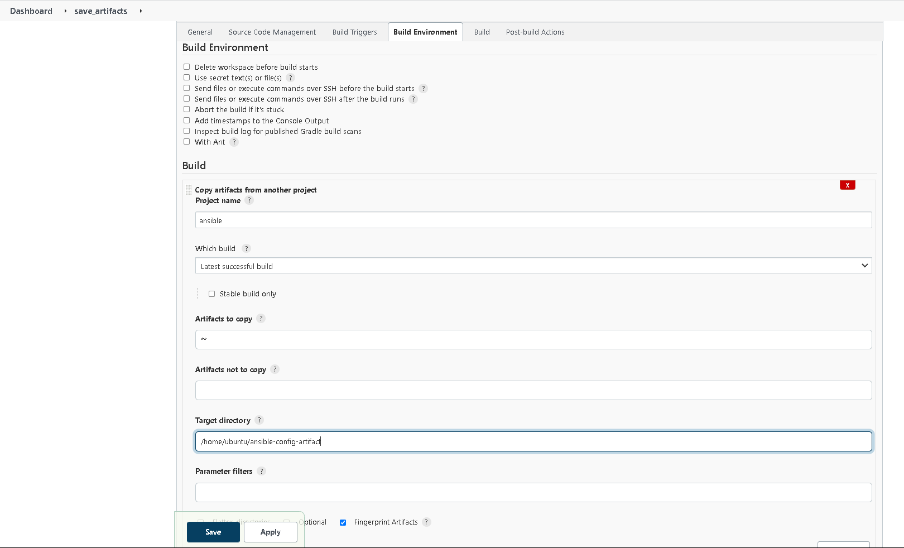

# Project 12 - Ansible refactoring and static assignments (imports and roles)

## Architecture
- In this project, Ansible static assignments (imports and roles) were used to deploy to servers:


## Step 1 – Jenkins job enhancement
- Create a new directory on the Jenkins-Ansible server called `ansible-config-artifact` – to store all artifacts after each build; 
``` shell
sudo mkdir /home/ubuntu/ansible-config-artifact

# Change permissions to this directory, so Jenkins could save files there
chmod -R 0777 /home/ubuntu/ansible-config-artifact
```

- Install `Copy Artifact` plugin without restarting Jenkins


- Create a new Freestyle Project and configure its job to run after the ansible jenkins job is done:


- Add build step to save artifacts from previously configured `ansible` project` in [Project-9](https://github.com/amadinathaniel/Devops-PBL/blob/main/Project-9/project9.md)



- Make a change the Github repo and verify that the new job runs:


## Step 2 – Refactor Ansible code by importing other playbooks into site.yml
- Create the static assignments directory and move the common.yml file to the new directory 
``` shell
mkdir static-assignments
mv playbooks/common.yml static-assignments/
```

- Create site.yml in the playbooks directory and import the common.yml file – *This file will now be considered as an entry point into the entire infrastructure configuration*
``` yaml
touch playbooks/site.yml
cat << EOF > playbooks/site.yml
---
- hosts: all
- import_playbook: ../static-assignments/common.yml
EOF
```

- Create another playbook - `common-del.yml` to remove previously installed wireshark
``` shell
vi static-assinments/common-del.yml
```

- In this playbook, configure deletion of wireshark utility by adding the code below:
``` yaml
- name: update web and nfs servers 
  hosts: webservers, nfs
  remote_user: ec2-user
  become: yes
  become_user: root
  tasks:
  - name: delete wireshark
    yum:
      name: wireshark
      state: removed

- name: update LB and db servers
  hosts: lb, db
  remote_user: ubuntu
  become: yes
  become_user: root
  tasks:
  - name: delete wireshark
    apt:
      name: wireshark-qt
      state: absent
      autoremove: yes
      purge: yes
      autoclean: yes
```

- Update site.yml with - `import_playbook: ../static-assignments/common-del.yml`
``` shell
sed -i 's/common.yml/common-del.yml/g' playbooks/site.yml
```

- Update code on Github, Raise a Pull request and merge the pull request with main branch
``` shell
git add .
git commit -m "Added Static Assignments and updated playbooks/site.yml"
git push --set-upstream origin refactor
```

- Access the Jenkins-Ansible server and run the ssh-agent service
``` shell
eval `ssh-agent -s`
ssh-add pbl-projects.pem
```

- Run the ansible command using the site.yml
``` shell
export ANSIBLE_HOST_KEY_CHECKING=False
ansible-playbook -i /home/ubuntu/ansible-config-artifact/inventory/dev.yml /home/ubuntu/ansible-config-artifact/playbooks/site.yml
```


- Verify that wireshark was removed:


## Step 3 – Configure UAT Webservers with a role ‘Webserver’
- Launch 2 fresh EC2 instances using RHEL 8 image, we will use them as our uat servers


- Create a directory called roles from the Jenkins Ansible server/ansible-config-artifact directory:
``` shell
mkdir roles
cd roles
```

- Use the ansible-galaxy to create the webserver role
``` shell
ansible-galaxy init webserver
``` 

- Navigate to the webserver directory created by ansible-galaxy and remove the unneeded folders
``` shell
cd webserver/
rm -rf tests files vars
```

- Copy the pruned webserver directory to the cloned repo on your local system
``` shell
# Navigate to the local repository

# Run the command
scp -r -i ~/devops-pbl.pem ubuntu@18.202.143.107:~/ansible-config-artifact/roles/ .
```

- Update your inventory `ansible-config-mgt/inventory/uat.yml` file with IP addresses of your 2 UAT Web servers
``` yaml
[uat-webservers]
172.31.16.128 ansible_ssh_user='ec2-user'
172.31.29.105 ansible_ssh_user='ec2-user'
```

- In /etc/ansible/ansible.cfg file, uncomment roles_path string and provide a full path to your roles directory so Ansible could know where to find configured roles.
``` shell
sudo vim /etc/ansible/ansible.cfg
```


- Add some logic to the tasks/main.yml on local system file to deploy httpd and clone the tooling repo on the newly launched EC2 instances
``` yaml
vi tasks/main.yml

---
# tasks file for webserver
- name: install apache
  become: true
  ansible.builtin.yum:
    name: "httpd"
    state: present

- name: install git
  become: true
  ansible.builtin.yum:
    name: "git"
    state: present

- name: clone a repo
  become: true
  ansible.builtin.git:
    repo: https://github.com/amadinathaniel/tooling.git
    dest: /var/www/html
    force: yes

- name: copy html content to one level up
  become: true
  command: cp -r /var/www/html/html/ /var/www/

- name: Start service httpd, if not started
  become: true
  ansible.builtin.service:
    name: httpd
    state: started

- name: recursively remove /var/www/html/html/ directory
  become: true
  ansible.builtin.file:
    path: /var/www/html/html
    state: absent
```
## Step 4 – Reference ‘Webserver’ role

- Within the static-assignments folder, create a new assignment for uat-webservers uat-webservers.yml. This is where you will reference the role.
``` yaml
touch static-assignments/uat-webservers.yml

cat << EOF > static-assignments/uat-webservers.yml
---
- hosts: uat-webservers
  roles:
    - webserver
EOF
```

- Update the site.yml file as shown below, to refer to your uat-webservers.yml role inside site.yml.
``` yaml
---
- hosts: all
- import_playbook: ../static-assignments/common.yml

# Add this portion
- hosts: uat-webservers
- import_playbook: ../static-assignments/uat-webservers.yml
```

## Step 5 – Commit & Test
- Push the code to Github and merge pull requests to trigger the Jenkins build:
``` shell
git add .
git -m "commit message"
git push origin refactor
```
- Add the UAT Webservers to the .ssh/known_hosts by connecting to them from the Jenkins-Ansible server 

- Run the Ansible code to deploy the scripts to the UAT web servers:
```
ansible-playbook -i /home/ubuntu/ansible-config-artifact/inventory/uat.yml /home/ubuntu/ansible-config-artifact/playbooks/site.yml
```

- Navigate to the webserver Public IP and confirm that it shows the tooling page:


