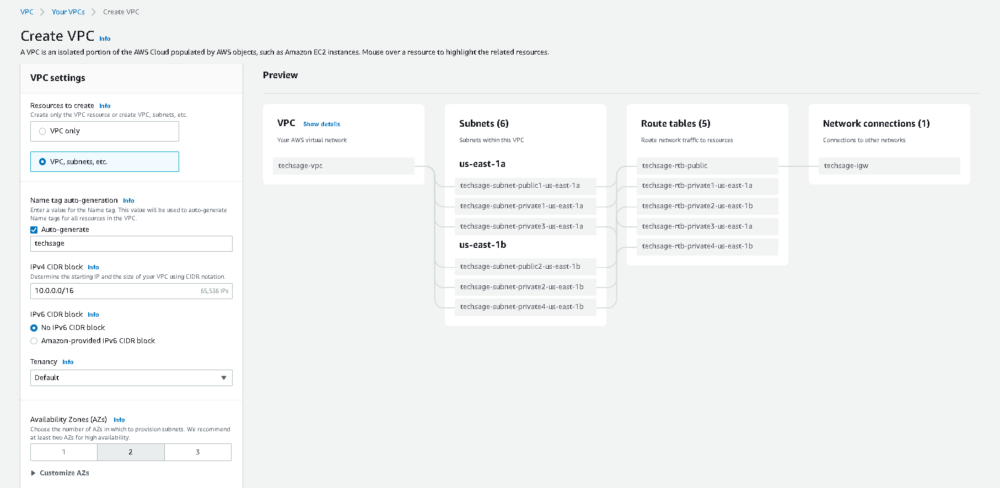
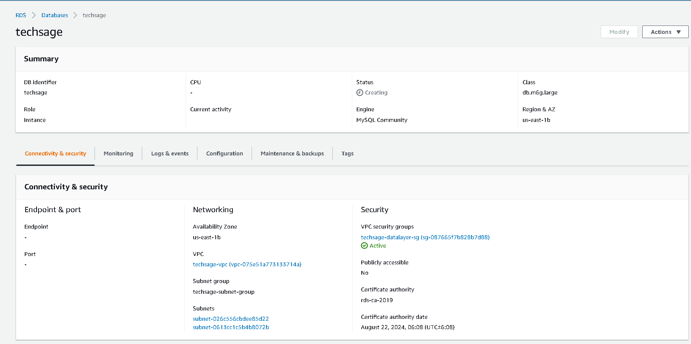
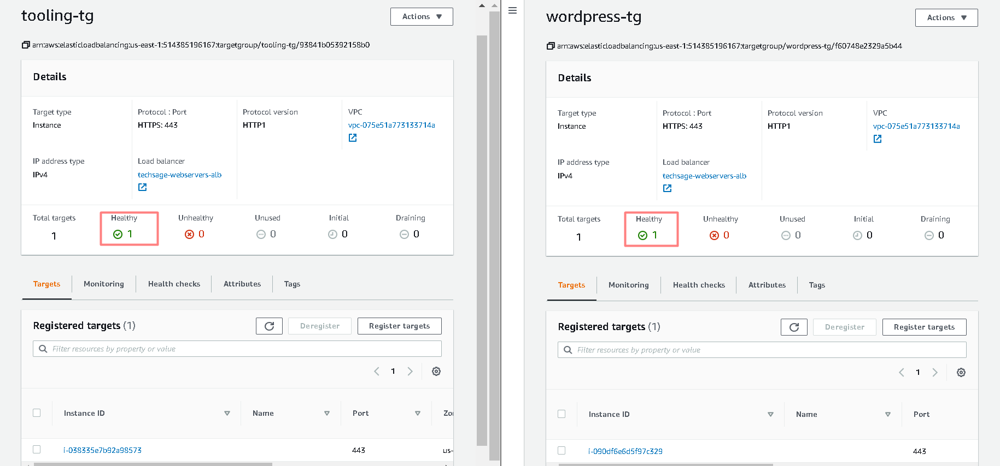

# AWS Cloud Solution For 2 Company Websites Using A Reverse Proxy Technology

## Architecture
WARNING: This infrastructure set up is NOT covered by AWS free tier. Therefore, ensure to DELETE ALL the resources created immediately after finishing the project. 
Monthly cost may be shockingly high if resources are not deleted. 

We will build a secure infrastructure inside AWS VPC (Virtual Private Cloud) network for a fictitious company that uses WordPress CMS for its main business website, 
and a [Tooling Website](https://github.com/amadinathaniel/tooling) for their DevOps team. As part of the company’s desire for improved security and performance, 
a decision has been made to use a reverse proxy technology from NGINX to achieve this.

Cost, Security, and Scalability are the major requirements for this project. Hence, implementing the architecture designed below, ensure that infrastructure for both websites, 
WordPress and Tooling, is resilient to Web Server’s failures, can accomodate to increased traffic and, at the same time, has reasonable cost.


## Domain Setup


### Migrate DNS
- Set up a hostedzone to migrate the dns for the domain to route53


### Request a Certificate from ACM
- Navigate to AWS Certificate Manager.
- Click on Request public certificate
- Provide the Fully Qualified Domain Name: *.techsage.tk
- Select DNS Validation


### Validate the DNS for ACM.
- Navigate to Route53 and create the CNAME record provided:


- Confirm DNS propagation using [mxtoolbox](https://mxtoolbox.com/DNSLookup.aspx); Refresh the ACM WebPage to verify that the certificate has been issued:


## Networking Setup

### Create VPC
- Create the vpc using any of the VPC Wizard.

- This helps to create the VPC, subnets and route tables with less modifications.

- Ensure two Availability zones, 2 Public and 4 Private subnets are selected



- Create NAT Gateway in the public subnet


- Cleanup the pre-configured routetables and configure only two route tables - private and public:


- Set the private routetable to point to NAT gateway for the four private subnets


- Set the public routetable to point to internet for the two public subnets


### Set up the Security Groups:

- Nginx Servers:
	- Access to Nginx should only be allowed from a Application Load balancer (ALB) and Bastion
	
	
	
- Bastion Servers:
	- Access to the Bastion servers should be allowed only from workstations that need to SSH into the bastion servers.
	- AWS has a feature while configuring Security Groups that detects your current IP (My-IP) in the security group
	
	
	
- Application Load Balancer:
	- ALB will be available from the Internet
	- This SG will be used for both External and Internal ALB.
	
	
	
- Webservers:
	- Access to Webservers should only be allowed from the Nginx servers, Internal ALB and Bastion servers
	
	
	
- Data Layer:
	- Access to the Data layer
	- Webservers should be able to connect to RDS
	- Nginx and Webservers will have access to EFS Mountpoint.
	
	
	
## DataLayer Setup

### Create Elastic File System EFS
- Ensure datalayer Security Group was selected


- Create Access points for Nginx server, Wordpress and Tooling server
- Ensure the POSIX user and Creation info (0755) to allow connectivity and seamless administration of files


### Create KMS for Database
- Create a KMS key from Key Management Service (KMS) to be used to encrypt the database instance.
	- Navigate to AWS KMS
	- Click create key
	- Make sure it's symmetric
	- Give the key an alias
	- For 'Define Key admininstrative privileges', select OrganizationAccountAccessRole


### Create RDS
- Create Database Subnet group using the private subnets 3 & 4


- Create Database, select choose Dev/Test Template and also select Multi-AZ DB Instance to meet the design requirements

- Ensure the datalayer SG and DB Subnet group was selected



- Ensure the KMS created previously was applied in the setup:


- Note down the db credentials

### AMI Setup
- Launch a CentOS Instance and pre-install it with defaults requirements
```bash
sudo su
yum update -y
yum install -y python3 ntp net-tools vim wget telnet epel-release htop
```

- Navigate to Instance and select CentOS instance > Actions > Images and Templates > Create Image to create the AMI for the instances


### Setup Templates fot Bastion and Webservers
- Navigate to the EC2 Instances > Launch Templates to create launch templates using the Centos AMI.

- Each pair of servers has unique userdatas and attributes.

**Bastion Launch Template**
- Create the Launch template for the Bastion server using the Centos AMI
- Ensure that a public subnet is selected for this and other configurations like Instance Type, EBS Volume size, Bastion SG is configured.
- Navigate to the Advanced settings > Userdata and paste the following to setup the Bastion server:
```bash
#!/bin/bash
hostnamectl set-hostname bastion-server
yum update -y	sudo yum install -y git ansible
```
- Launch an Instance from the Launch Template and verify that all configurations are reflected
	
**WordPress Launch Template**

- Create the Launch template for the wordpress server using the Centos AMI

- Ensure that a private subnet(1 or 2) is selected for this and other configurations like Instance Type, EBS Volume size, Webservers SG is configured.

- Ensure that Public IP is removed from the network configuration as access to the wordpress instance will be via the Bastion server

- Navigate to the Advanced settings > Userdata and paste the following to setup the Wordpress:
```bash
#!/bin/bash
hostnamectl set-hostname wordpress-server
yum -y install git rpm-build make
git clone https://github.com/aws/efs-utils
cd efs-utils
make rpm
yum -y install build/amazon-efs-utils*rpm
sed -i "s/stunnel_check_cert_hostname = true/stunnel_check_cert_hostname = false/g" /etc/amazon/efs/efs-utils.conf
mkdir /var/www/
mount -t efs -o tls,accesspoint=fsap-0d1a939e5524bd8f3 fs-032f616f656b250b8:/ /var/www/
yum install -y httpd 
systemctl start httpd
systemctl enable httpd
cd ~
echo "installing php"
wget https://dl.fedoraproject.org/pub/epel/epel-release-latest-7.noarch.rpm       
wget https://rpms.remirepo.net/enterprise/remi-release-7.rpm                      
rpm -Uvh remi-release-7.rpm epel-release-latest-7.noarch.rpm                      
yum-config-manager --enable remi-php74                         
yum install -y php php-common php-mbstring php-opcache php-intl php-xml php-gd php-curl php-mysqlnd php-fpm php-json                   
sudo systemctl start php-fpm                                                      
sudo systemctl enable php-fpm
echo "installing wordpress"                                                     
wget http://wordpress.org/latest.tar.gz
tar xzvf latest.tar.gz
rm -rf latest.tar.gz
cp wordpress/wp-config-sample.php wordpress/wp-config.php
mkdir /var/www/html/
cp -R wordpress/* /var/www/html/
cd /var/www/html/
touch healthstatus
sed -i "s/localhost/techsage.cbjrge0vbjxr.us-east-1.rds.amazonaws.com/g" wp-config.php 
sed -i "s/username_here/admin/g" wp-config.php 
sed -i "s/password_here/experiment626/g" wp-config.php 
sed -i "s/database_name_here/test/g" wp-config.php
echo "setting selinux permissions"
setsebool -P httpd_use_nfs 1
setsebool -P httpd_can_network_connect=1
setsebool -P httpd_execmem=1
yum install -y mod_ssl
systemctl restart httpd
```

- The WordPress userdata does the following:
	- Installs the amazon efs utility to connect to efs
	- Removes tls limitation for efs which is specific to CentOS 7
	- Sets the selinux to allow the webserver access and utilize nfs
	- Creates a directory for the webserver files and mounts the efs access point partition to it
		- To get the mount command. Go to EFS Service > Access Points > wordpress > Attach. Then copy the command
	**Blocker:** Ensure that the VPC created has "DNS hostname" setting enabled, so that mounting the file system works.
	- Install and enable apache webserver
	- Install and enable PHP
	- Create the /var/www/html directory
	- Downloads Wordpress
	- Move Wordpress content to the mounted partition
	- Replace inline the database credentials 
		- This is from the RDS instance created earlier > Connectivity and Security > Endpoint. Use the credentials saved earlier.
	- Creates the health status check in the /var/www/html directory
	- Change the SELinux permissions to allow httpd use nfs, connect to db
	- Install ssl module on apache to activate https(443) listening port
	- Restart Apache to reflect the new configurations
- Launch an Instance from the Launch Template and verify that all configurations are reflected

**Tooling Launch Template**
- Create the Launch template for the nginx server using the Centos AMI

- Ensure that a public subnet is selected for this and other configurations like Instance Type, EBS Volume size, Nginx-SG is configured.

- Navigate to the Advanced settings > Userdata and paste the following to setup the Nginx:
```bash
#!/bin/bash
hostnamectl set-hostname tooling-server
yum -y install git rpm-build make
git clone https://github.com/aws/efs-utils
cd efs-utils
make rpm
yum -y install build/amazon-efs-utils*rpm
sed -i "s/stunnel_check_cert_hostname = true/stunnel_check_cert_hostname = false/g" /etc/amazon/efs/efs-utils.conf
mkdir /var/www/
mount -t efs -o tls,accesspoint=fsap-090d3d5b58ec24641 fs-032f616f656b250b8:/ /var/www/
yum install -y httpd 
systemctl start httpd
systemctl enable httpd
cd ~
echo "installing php"
wget https://dl.fedoraproject.org/pub/epel/epel-release-latest-7.noarch.rpm       
wget https://rpms.remirepo.net/enterprise/remi-release-7.rpm                      
rpm -Uvh remi-release-7.rpm epel-release-latest-7.noarch.rpm                      
yum-config-manager --enable remi-php74                         
yum install -y php php-common php-mbstring php-opcache php-intl php-xml php-gd php-curl php-mysqlnd php-fpm php-json                   
sudo systemctl start php-fpm                                                      
sudo systemctl enable php-fpm
git clone https://github.com/amadinathaniel/tooling.git
mkdir /var/www/html
cp -R tooling/html/* /var/www/html/
cd tooling
mysql -h techsage.cbjrge0vbjxr.us-east-1.rds.amazonaws.com -u admin -pexperiment626 -e "create database toolingdb"
mysql -h techsage.cbjrge0vbjxr.us-east-1.rds.amazonaws.com -u admin -pexperiment626 toolingdb < tooling-db.sql
cd /var/www/html/
touch healthstatus
sed -i "s/$db = mysqli_connect('mysql.tooling.svc.cluster.local', 'admin', 'admin', 'tooling');/$db = mysqli_connect('techsage.cbjrge0vbjxr.us-east-1.rds.amazonaws.com', 'admin', 'experiment626', 'toolingdb');/g" functions.php
setsebool -P httpd_use_nfs 1
setsebool -P httpd_can_network_connect=1
setsebool -P httpd_execmem=1
yum install -y mod_ssl
systemctl restart httpd
```

- The Tooling userdata does the following:
	- Installs the amazon efs utility to connect to efs
	- Removes tls limitation for efs which is specific to CentOS 7
	- Sets the selinux to allow the webserver access and utilize nfs
	- Creates a directory for the webserver files and mounts the efs access point partition to it
		- To get the mount command. Go to EFS Service > Access Points > tooling > Attach. Then copy the command
	- Install and enable apache webserver
	- Install and enable PHP
	- Create the /var/www/html directory
	- Clones the tooling github repo
	- Moves the tooling repo html content to the mounted partition
	- Creates the sql database
	- Creates the sql data in the tooling.sql file
	- Creates the health status check in the /var/www/html directory
	- Replace inline the database credentials
		- - This is from the RDS instance created earlier > Connectivity and Security > Endpoint. Use the credentials saved earlier.
	- Change the SELinux permissions to allow httpd use nfs, connect to db
	- Install ssl module on apache to activate https(443) listening port
	- Restart Apache to reflect the new configurations
- Launch an Instance from the Launch Template and verify that all configurations are reflected

**Create a Target Group for Wordpress, Bastion and Tooling.**
- Ensure the TCP protocol is 22 for Bastion and HTTPS protocol 443 for WordPress and Tooling
- Set the healthcheck path as "/healthstatus"
- Register the already created instance
- Ensure that the instances return healthy



- Create an Automatic Scaling group and select desired capacity the matching launch template and target groups for the Wordpress, Bastion and Tooling.

~[create_autoscaling_groups](Screenshots/create_autoscaling_groups.png)

### Create Internal Load Balancer
Navigate to the Load balancers and create an Internal Load Balancer

- Select the internal load balancer option
- Select IPv4
- Map the load balancer to the two Availability zones
- Select the ALB Security Group
- select the wordpress target group
- select listener port https
- Select certificate issued earlier from ACM


**Configure the Internal Load Balancer**
- Navigate to Listeners
- Click on View/Edit rules for the target groups
- Click on the Plus (+) icon to add a new rule.
- Add the host header rule to map host to the specific target group, such that tooling.domain.com links to the tooling target groups and every other rule leads to the wordpress target groups


### Template Setup for NGINX
**Setup Nginx Launch Template**
- Create the Launch template for the nginx server using the Centos AMI

- Ensure that a public subnet is selected for this and other configurations like Instance Type, EBS Volume size is configured.

- Navigate to the Advanced settings > Userdata and paste the following to setup the Nginx:
```bash
#!/bin/bash
hostnamectl set-hostname nginx-rp-server
yum -y install nginx git rpm-build make
systemctl enable --now nginx
git clone https://github.com/aws/efs-utils
cd efs-utils
make rpm
yum -y install build/amazon-efs-utils*rpm
sed -i "s/stunnel_check_cert_hostname = true/stunnel_check_cert_hostname = false/g" /etc/amazon/efs/efs-utils.conf
mount -t efs -o tls,accesspoint=fsap-071d45ae9557b608e fs-032f616f656b250b8:/ /var/log/nginx/
setsebool -P httpd_use_nfs 1
cd ~
git clone https://github.com/amadinathaniel/acs-config.git
mkdir -p /etc/ssl/private
chmod 700 /etc/ssl/private
openssl req -x509 -nodes -days 365 -newkey rsa:2048 -keyout /etc/ssl/private/ACS.key -out /etc/ssl/certs/ACS.crt -config acs-config/req.conf
mv /etc/nginx/nginx.conf /etc/nginx/nginx.conf.bak
mv acs-config/nginx.conf /etc/nginx/nginx.conf
chcon -t httpd_config_t /etc/nginx/nginx.conf
mkdir -p /var/www/html             
touch /var/www/html/healthstatus
systemctl restart nginx
rm -rf acs-config
```

- The userdata does the following:
	- Installs the amazon efs utility to connect to efs
	- removes tls limitation which is specific to CentOS 7
	- Sets the selinux to allow the webserver access and utilize nfs
	- Clones a github repo to retrieve the preconfigured self signed ssl requests configuration file
	- Creates a required directory to input the self signed key
	- Creates a self signed key with the configuration file
	- Modifies the the nginx.conf to include setting for the reverse proxy configuration
	- Change the SELinux content of the new nginx.conf file
	- Create a new directory on the /var/www/html and inserts the healthstatus check page
	
- The specific nginx.conf file that was modified is shown below:
```bash
    server {
        listen       80;
        listen       443 http2 ssl;
        listen       [::]:443 http2 ssl;
        root         /var/www/html;
        server_name  *.techsage.tk;      
        
        ssl_certificate /etc/ssl/certs/ACS.crt;
        ssl_certificate_key /etc/ssl/private/ACS.key;


        location /healthstatus {
        access_log off;
        return 200;
     }
    

      location / {
            proxy_set_header             Host $host;
            proxy_pass                   https://internal-techsage-webservers-alb-924560653.us-east-1.elb.amazonaws.com; 
        }
    }
```

- The nginx.conf includes a listening port for 443 as well as the path to the SSL Certificate.

- It also includes the proxy_pass to the Internal ALB.

- This is such that all traffic directed from the external ALB to the nginx servers will be proxied to the internal ALB.

- Launch an Instance from the Launch Template and verify that all configurations are reflected

- All launch templates should be as shown:


- Create a Target Group for Nginx.
	- Ensure HTTPS protocol 443 for Nginx
	- Set the healthcheck path as "/healthstatus"
	- Register the already created instance
	- Ensure that the instances return healthy
	
	- All target groups should be as shown:
	
	
	
- Create an Automatic Scaling group and select desired capacity the matching launch template and target groups for Nginx.

- All ASGs should be as shown below:


	
### Setup External LoadBalancer
- Create an external loadbalancer
	- Ensure "internet facing" is selected
	- Select the internal load balancer option
	- Select IPV4
	- Map the load balancer to the two Availability zones
	- Select the ALB Security Group
	- select the nginx target group
	- select listener port https
	- Select certificate issued earlier from ACM	
	
	
	
- Configure Route 53 and set routes to the External Load Balancer
	- Configure routes to tooling.<your_domain_name>.com as an alias to the External Load balancer, in this case, tooling.techsage.tk
	
	
	
	- Configure routes to wordpress.<your_domain_name>.com as an alias to the External Load balancer, in this case, wordpress.techsage.tk
	
	
	
### Test Connectivity
- Navigate to the tooling website by prefixing the domain with tooling and confirm that the page loads and is accessible:


- Navigate to the wordpress website with just the domain name,complete and confirm that the page loads and is accessible:

**Blockers:** 
- Ensure that the "test" database for wordpress is created initially while creating the RDS instance or else the wordpress site won't load.
There will be a database connection error.

- I was getting a 502 Bad Gateway error, to solve this, I checked the logs for my nginx instance (I had to SSH into it) and noticed it was returning a permission denied error, so I did:
```bash
sudo setsebool -P httpd_can_network_connect 1
```

[Back to top](#)
