# Project 2 - LEMP Stack Implementation

## Step 1 - Installing the Nginx Web Server
- Update a list of packages in package manager

`$ sudo apt update`

- Run nginx package installation

`$ sudo apt install nginx`

- Verify that nginx service is running successfully

`$ sudo systemctl status nginx`
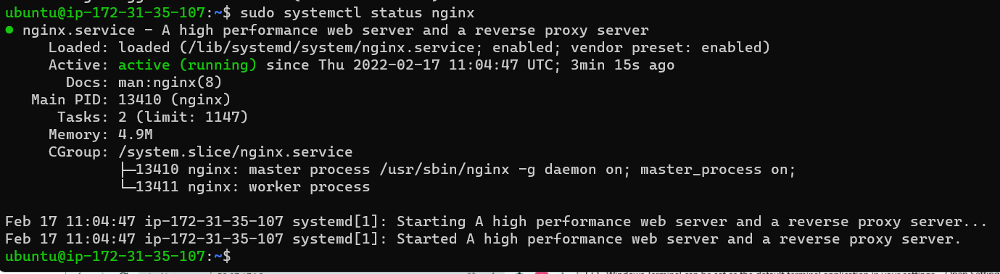

- Verify using curl

`$ curl http://localhost:80`
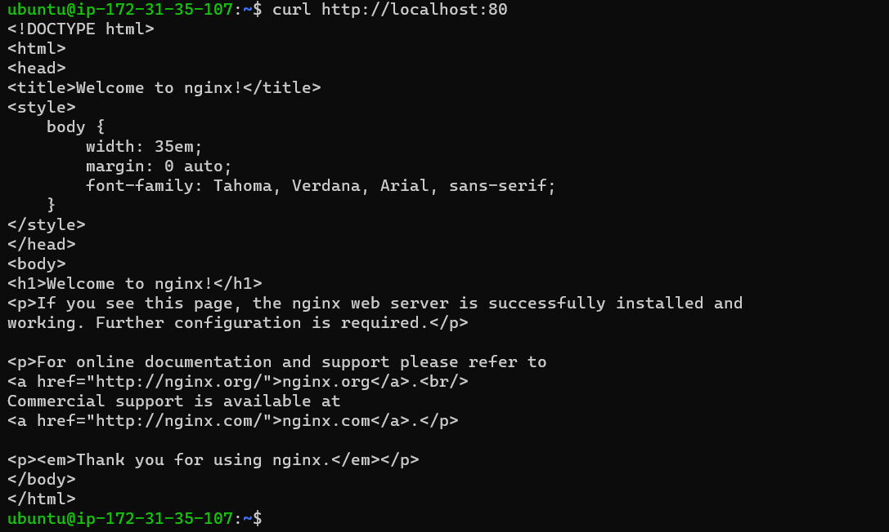

- Verify using Public IP
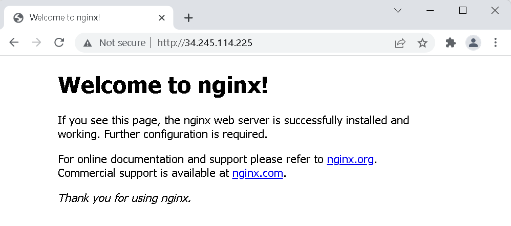

## Step 2 — Installing MySQL
- Install MySQL

`$ sudo apt install mysql-server`

- Run security script to remove some insecure default settings and lock down access to the database system

`$ sudo mysql_secure_installation`

- Access MySQL

`$ sudo mysql`
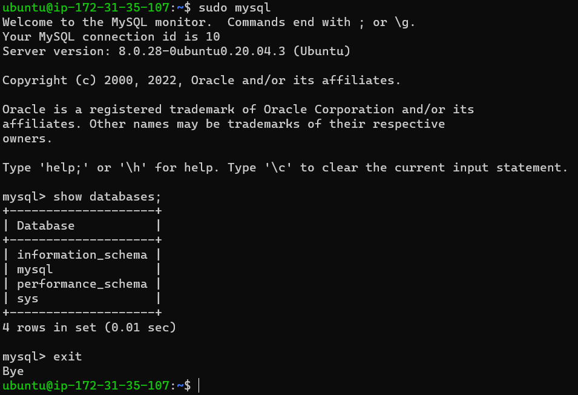

## Step 3 – Installing PHP
- Install PHP

`$ sudo apt install php-fpm php-mysql -y`

`$ php -v`

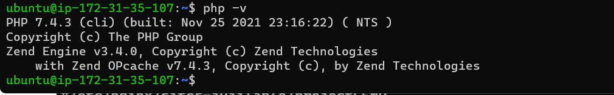

## Step 4 — Configuring Nginx to Use PHP Processor
- Create the root web directory for the domain

`$ sudo mkdir /var/www/projectLEMP`

- Assign ownership of the directory with current system user

`$ sudo chown -R $USER:$USER /var/www/projectLEMP`

- Create and open a new configuration file in Nginx’s sites-available directory using "nano" command-line editor

`$ sudo nano /etc/nginx/sites-available/projectLEMP`
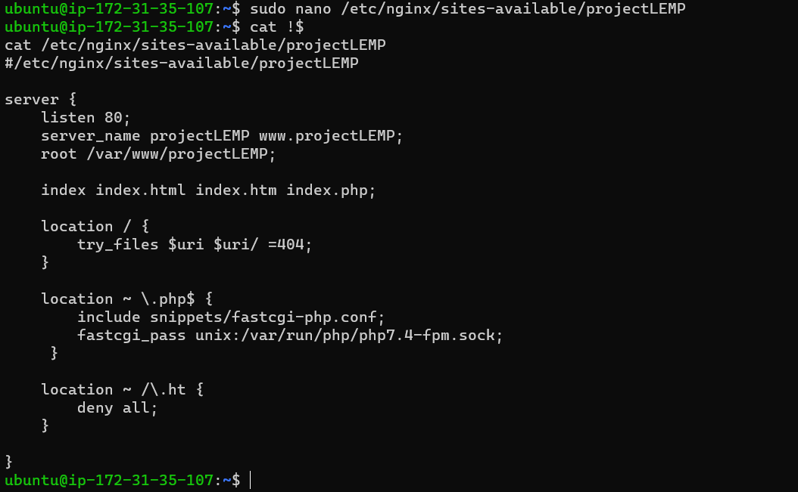

- Activate the configuration by linking to the config file from Nginx’s sites-enabled directory

`$ sudo ln -s /etc/nginx/sites-available/projectLEMP /etc/nginx/sites-enabled/`

- Test configuration for syntax errors

`$ sudo nginx -t`
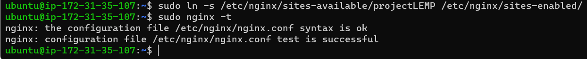

- Disable default Nginx host that is currently configured to listen on port 80

`$ sudo unlink /etc/nginx/sites-enabled/default`

- Reload Nginx to apply the changes

`$ sudo systemctl reload nginx`

- Create an index.html file in that location to test the new server block

`$ sudo echo 'Hello LEMP from hostname' $(curl -s http://169.254.169.254/latest/meta-data/public-hostname) 'with public IP' $(curl -s http://169.254.169.254/latest/meta-data/public-ipv4) > /var/www/projectLEMP/index.html`
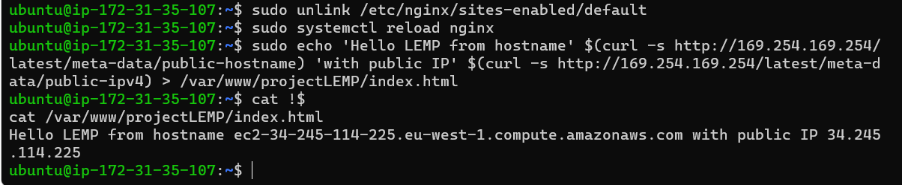

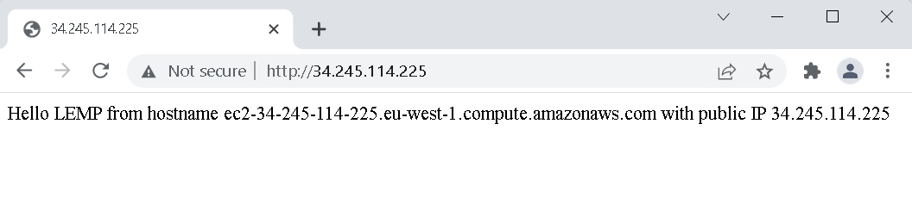

**LEMP stack is completely installed and fully operational.**

## Step 5 – Testing PHP with Nginx
- Open a new file called info.php within your document root in your text editor

`$ sudo nano /var/www/projectLEMP/info.php`

- Enter the following lines and save:

``` php
<?php
phpinfo();
```
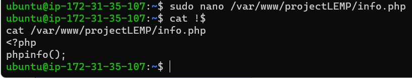

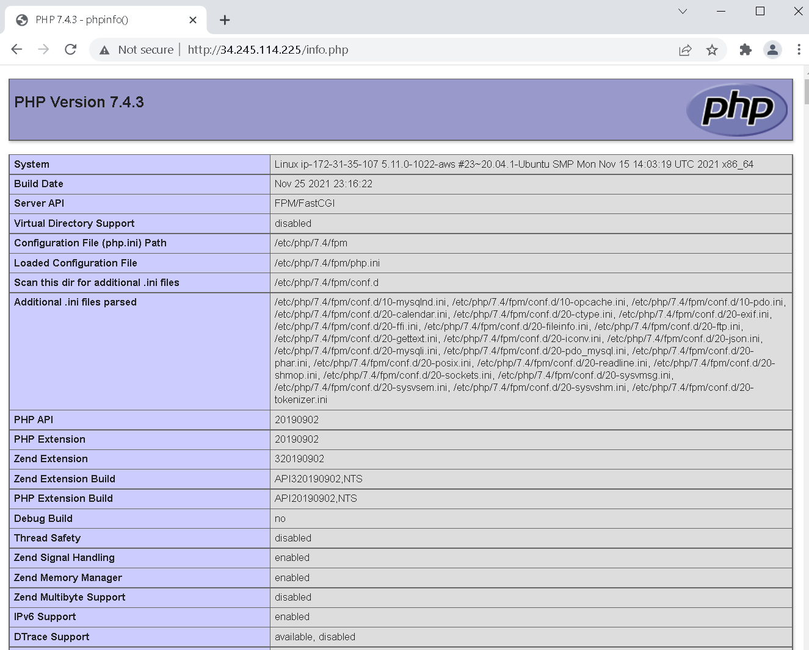

## Step 6 — Retrieving data from MySQL database with PHP
- Create a new database *example_database* and a new user; then grant the user full privileges to the database created
``` mysql
CREATE DATABASE `example_database`;
CREATE USER 'example_user'@'%' IDENTIFIED WITH mysql_native_password BY 'b3&OfKD@=E';
GRANT ALL ON example_database.* TO 'example_user'@'%';
exit
```
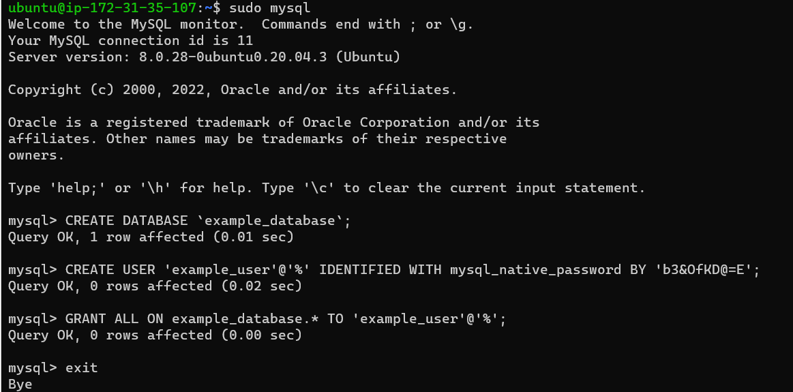

- Verify that user has permissions to login to the mysql console
`$ mysql -u example_user -p`

Then run the command to show the list of databases:

`$ SHOW DATABASES;`
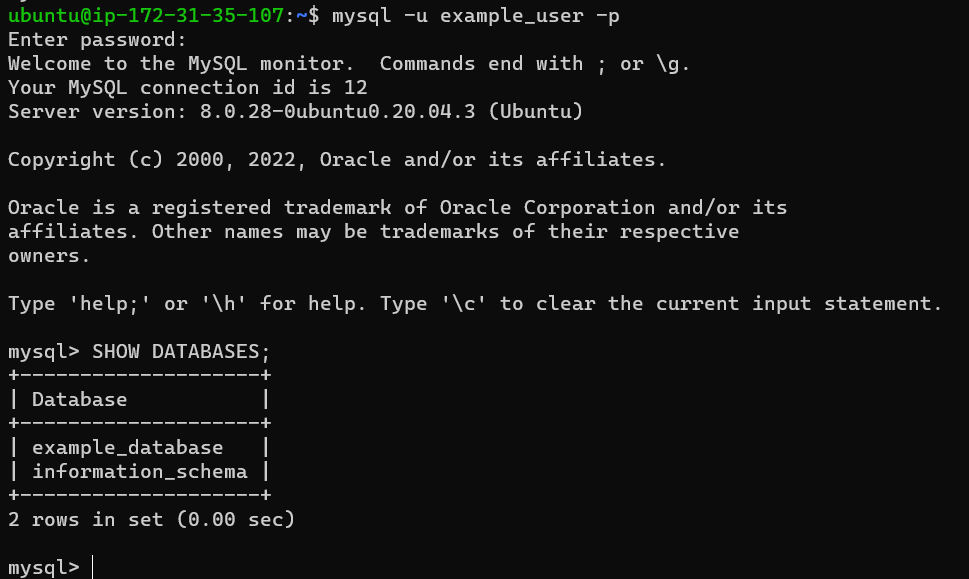


- Create Table *todo_list* on the previously created database
``` mysql
CREATE TABLE example_database.todo_list (
mysql>     item_id INT AUTO_INCREMENT,
mysql>     content VARCHAR(255),
mysql>     PRIMARY KEY(item_id)
mysql> );
```
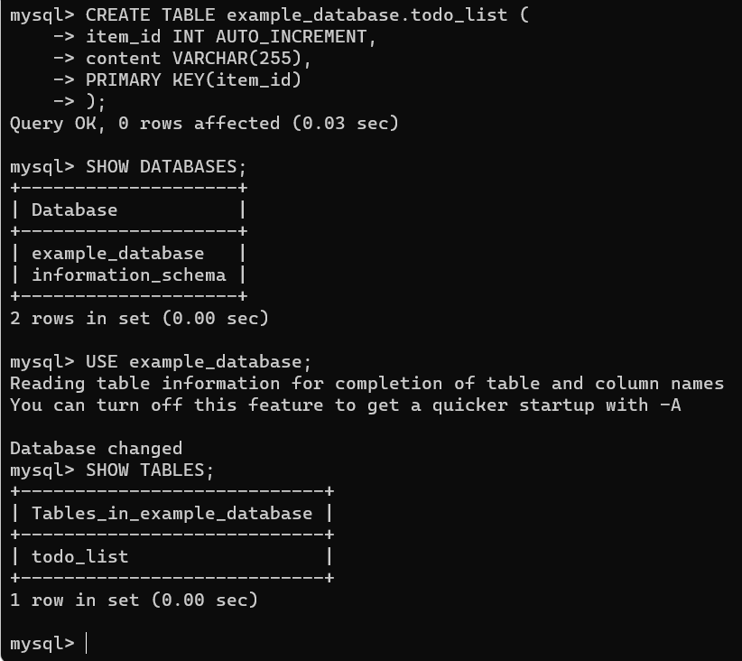

- Insert data into the table

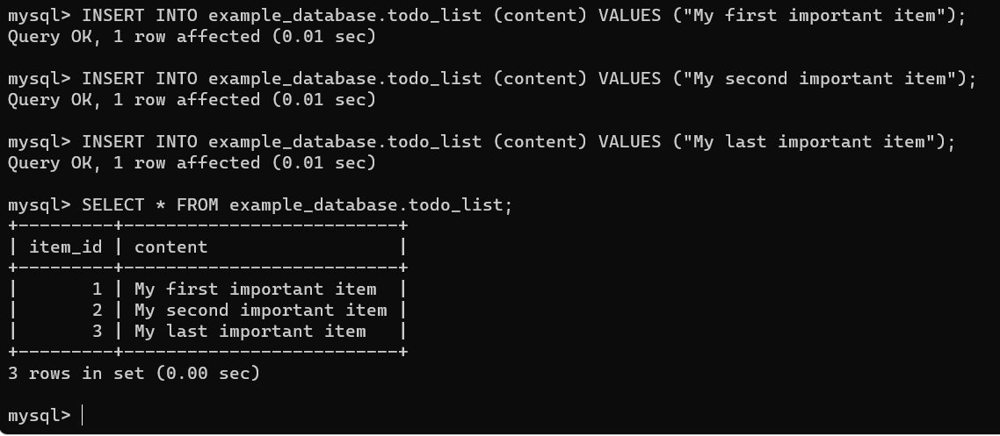

- Create a PHP script that connects to the Database and test

`$ nano /var/www/projectLEMP/todo_list.php`

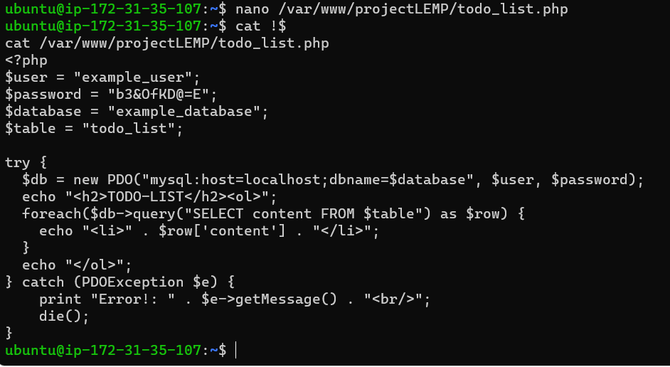

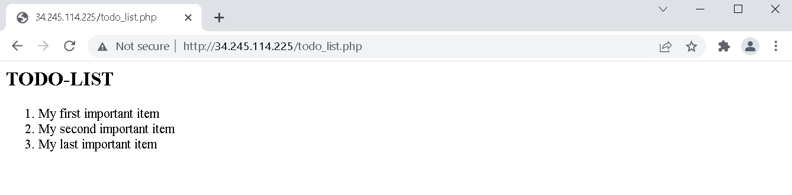

