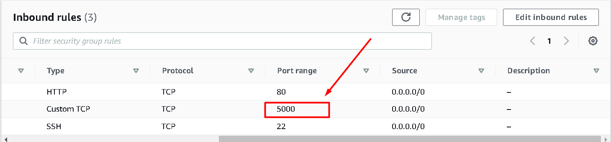
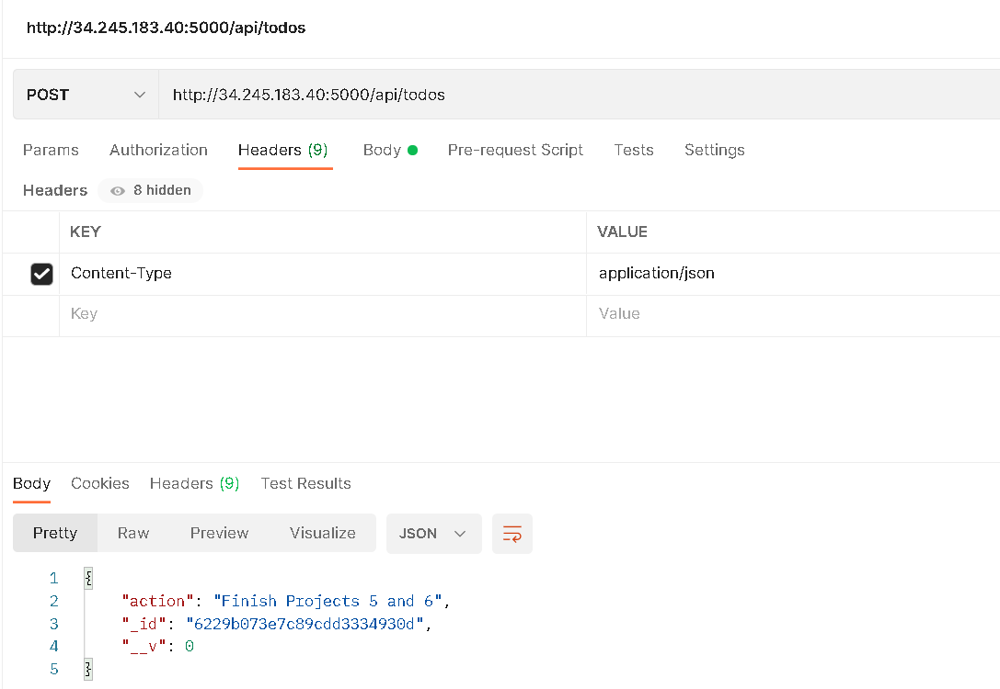

# Project3 - MERN Stack Implementation

## Step 1 - Backend configuration

### Update and Upgrade ubuntu
`$ sudo apt update`

`$ sudo apt upgrade`

- Get the location of Node.js software from Ubuntu repositories.

`$ curl -sL https://deb.nodesource.com/setup_12.x | sudo -E bash -`

### Install Node.js on the server
`$ sudo apt-get install -y nodejs

- Verify installation of nodejs and NPM package manager

`$ node -v`

`$ npm -v`


### Application Code Setup
``` shell
$ mkdir Todo
$ ls
$ cd Todo
$ npm init
```


### Install ExpressJS
`& npm install express`

`& touch index.js`


- Install the dotenv to use the environment variable and update the index.js file

`$ npm install dotenv`

`$ vim index.js`


- Open port 5000 on EC2 instance security group


- Verify that site is wrapped with ExpressJS


### Create ExpressJS Routes for Todo App
``` shell
$ cd Todo
$ mkdir routes && cd routes
$ touch api.js
$ vim api.js

```


### Create a MongoDB Model
``` shell
cd /home/Todo
sudo npm install mongoose
mkdir models && cd models && touch todo.js
```

- Update *todo.js* file created

`$ vim todo.js`


- Update the route to include connection to the MongoDB mode


### Setup MongoDB via MongoDB Cloud
- Create a Mongo DB cluster using DBaaS mLab which can be gotten from this link [mLab](https://www.mongodb.com/atlas-signup-from-mlab)

- In the index.js file, we specified process.env to access environment variables, so we have to create the process.env file in the Todo directory

`$ touch .env`

`$ vi .env`

- Then add the connection string as shown below
```
DB = 'mongodb+srv://<username>:<password>@<network-address>/<dbname>?retryWrites=true&w=majority'
```


- Update the index.js to reflect the use of .env so that Node.js can connect to the database.
`$ vim index.js`

Enter the following lines of code
``` javascript
const express = require('express');
const bodyParser = require('body-parser');
const mongoose = require('mongoose');
const routes = require('./routes/api');
const path = require('path');
require('dotenv').config();

const app = express();

const port = process.env.PORT || 5000;

//connect to the database
mongoose.connect(process.env.DB, { useNewUrlParser: true, useUnifiedTopology: true })
.then(() => console.log(`Database connected successfully`))
.catch(err => console.log(err));

//since mongoose promise is depreciated, we overide it with node's promise
mongoose.Promise = global.Promise;

app.use((req, res, next) => {
res.header("Access-Control-Allow-Origin", "\*");
res.header("Access-Control-Allow-Headers", "Origin, X-Requested-With, Content-Type, Accept");
next();
});

app.use(bodyParser.json());

app.use('/api', routes);

app.use((err, req, res, next) => {
console.log(err);
next();
});

app.listen(port, () => {
console.log(`Server running on port ${port}`)
});
```
Start the server by running

`$ node index.js`


### Testing Backend Code without Frontend using RESTful API
- Create POST request using **Postman**


- Create GET request using **Postman**


- Create a DELETE request and verify with a GET request using **Postman**
	- Do a POST request to add a new task to the already existing task
	

	

	- Do a DELETE request to delete the new task created
	

	-  Do a GET request to confirm that new task is deleted
	

## Step 2 – Frontend creation using ReactJS
- In the Todo directory run the command below to create the directory for the React App

`$ npx create-react-app client`

- Install some React.js dependencies.
``` shell
$ npm install concurrently --save-dev
$ npm install nodemon --save-dev
```
- Edit the Todo > package.json > scripts section with the code below:
``` json
"scripts": {
"start": "node index.js",
"start-watch": "nodemon index.js",
"dev": "concurrently \"npm run start-watch\" \"cd client && npm start\""
},
```
- Configure Proxy in package.json
``` shell
$ cd client
$ vi package.json
```


- Change directory to the Todo folder and run the below:

`$ cd /home/Todo && npm run dev`

The app should open and start running on localhost:3000

- Allow Port 3000 on AWS Security Group


### Creating your React Components
- Create the component files
``` shell
$ cd /home/Todo/client/src & 
$ mkdir components
$ cd components
$ touch Input.js ListTodo.js Todo.js
```

- Update the  file with the code below:

`$ vi Input.js`

``` javascript
import React, { Component } from 'react';
import axios from 'axios';

class Input extends Component {

state = {
action: ""
}

addTodo = () => {
const task = {action: this.state.action}

    if(task.action && task.action.length > 0){
      axios.post('/api/todos', task)
        .then(res => {
          if(res.data){
            this.props.getTodos();
            this.setState({action: ""})
          }
        })
        .catch(err => console.log(err))
    }else {
      console.log('input field required')
    }

}

handleChange = (e) => {
this.setState({
action: e.target.value
})
}

render() {
let { action } = this.state;
return (
<div>
<input type="text" onChange={this.handleChange} value={action} />
<button onClick={this.addTodo}>add todo</button>
</div>
)
}
}

export default Input
```


- Install axios - a Promise based HTTP client for the browser and node.js
``` shell
$ cd /home/ubuntu/Todo/client
$ npm install axios
$ cd src/components
```

- Update ListTodo.js
`$ vi ListTodo.js`

Enter the code below:
``` javascript
import React from 'react';

const ListTodo = ({ todos, deleteTodo }) => {

return (
<ul>
{
todos &&
todos.length > 0 ?
(
todos.map(todo => {
return (
<li key={todo._id} onClick={() => deleteTodo(todo._id)}>{todo.action}</li>
)
})
)
:
(
<li>No todo(s) left</li>
)
}
</ul>
)
}

export default ListTodo
```
- Update Todo.js
`$ vi Todo.js`

``` javascript
import React, {Component} from 'react';
import axios from 'axios';

import Input from './Input';
import ListTodo from './ListTodo';

class Todo extends Component {

state = {
todos: []
}

componentDidMount(){
this.getTodos();
}

getTodos = () => {
axios.get('/api/todos')
.then(res => {
if(res.data){
this.setState({
todos: res.data
})
}
})
.catch(err => console.log(err))
}

deleteTodo = (id) => {

    axios.delete(`/api/todos/${id}`)
      .then(res => {
        if(res.data){
          this.getTodos()
        }
      })
      .catch(err => console.log(err))

}

render() {
let { todos } = this.state;

    return(
      <div>
        <h1>My Todo(s)</h1>
        <Input getTodos={this.getTodos}/>
        <ListTodo todos={todos} deleteTodo={this.deleteTodo}/>
      </div>
    )

}
}

export default Todo;
```

- Update the App.js file with the code below
``` shell
$ cd /home/ubuntu/Todo/client/src
$ vi App.js
```
``` javascript
import React from 'react';

import Todo from './components/Todo';
import './App.css';

const App = () => {
return (
<div className="App">
<Todo />
</div>
);
}

export default App;
```

- Update the App.css file with the code below:
``` shell
$ cd /home/ubuntu/Todo/client/src
$ vi App.css
```
``` css
.App {
text-align: center;
font-size: calc(10px + 2vmin);
width: 60%;
margin-left: auto;
margin-right: auto;
}

input {
height: 40px;
width: 50%;
border: none;
border-bottom: 2px #101113 solid;
background: none;
font-size: 1.5rem;
color: #787a80;
}

input:focus {
outline: none;
}

button {
width: 25%;
height: 45px;
border: none;
margin-left: 10px;
font-size: 25px;
background: #101113;
border-radius: 5px;
color: #787a80;
cursor: pointer;
}

button:focus {
outline: none;
}

ul {
list-style: none;
text-align: left;
padding: 15px;
background: #171a1f;
border-radius: 5px;
}

li {
padding: 15px;
font-size: 1.5rem;
margin-bottom: 15px;
background: #282c34;
border-radius: 5px;
overflow-wrap: break-word;
cursor: pointer;
}

@media only screen and (min-width: 300px) {
.App {
width: 80%;
}

input {
width: 100%
}

button {
width: 100%;
margin-top: 15px;
margin-left: 0;
}
}

@media only screen and (min-width: 640px) {
.App {
width: 60%;
}

input {
width: 50%;
}

button {
width: 30%;
margin-left: 10px;
margin-top: 0;
}
}
```
- Update index.css file using the code below:
``` shell
$ cd /home/ubuntu/Todo/client/src
$ vim index.css
```
``` css
body {
margin: 0;
padding: 0;
font-family: -apple-system, BlinkMacSystemFont, "Segoe UI", "Roboto", "Oxygen",
"Ubuntu", "Cantarell", "Fira Sans", "Droid Sans", "Helvetica Neue",
sans-serif;
-webkit-font-smoothing: antialiased;
-moz-osx-font-smoothing: grayscale;
box-sizing: border-box;
background-color: #282c34;
color: #787a80;
}

code {
font-family: source-code-pro, Menlo, Monaco, Consolas, "Courier New",
monospace;
}
```

- Run the npm dev command to bring up the App
`$ cd /home/ubuntu/Todo`
`$ npm run dev`


