# Project6 - Web Solution with WordPress

## Step 1 - Prepare the Web Server
- Create an EC2 instance on AWS that will server as Web Server (We are using Red Hat OS for the linux image)

- Create and attach 3 EBS Volumes in the same Availabilty Zone as the Web Server

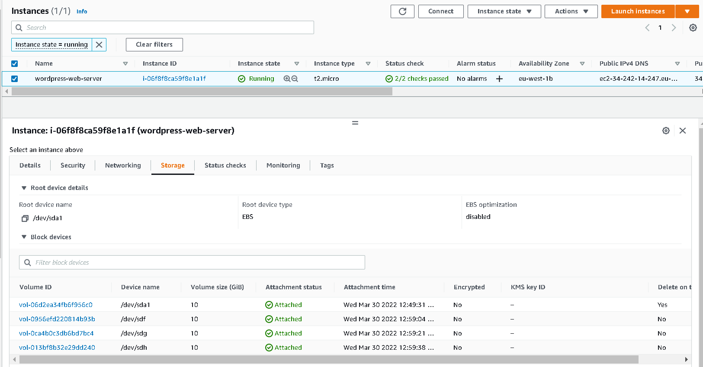

- Connect to the terminal and update the OS then begin configuration

`sudo yum update -y`

- Inspect what block devices are attached to the server
``` shell
lsblk
df -Th
```
- Install the gdisk partition system and partition the disks

```
sudo yum install gdisk -y
sudo gdisk /dev/xvdf
```
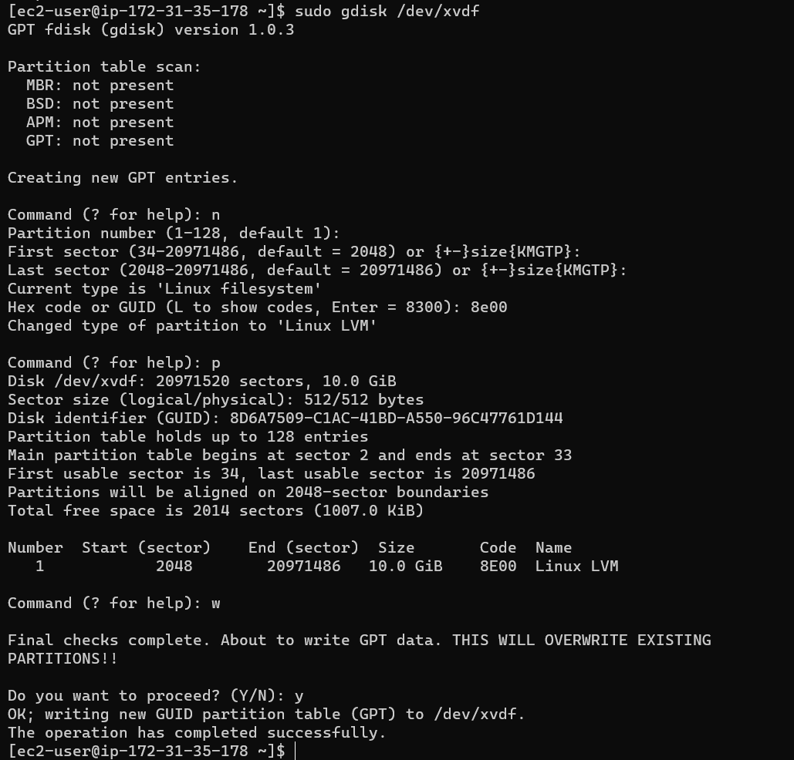

`sudo gdisk /dev/xvdg`

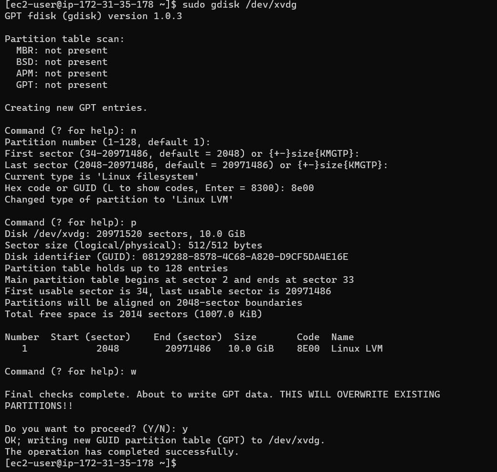

`sudo gdisk /dev/xvdh`

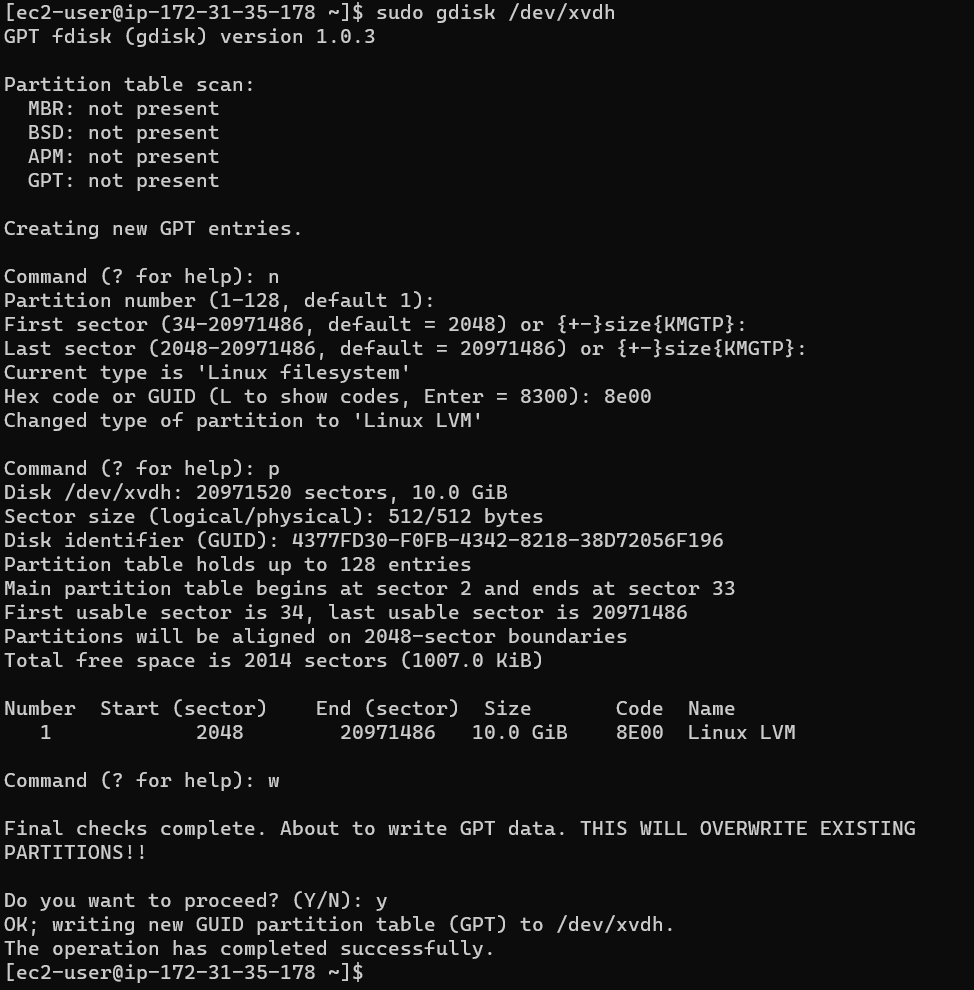

- Use lsblk utility to view the newly configured partition on each of the 3 disks.
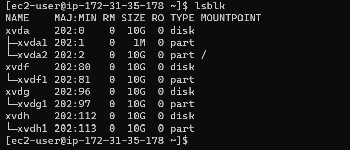

- Install lvm2 package and run the *lvmdiskscan* command to check for available partitions.
``` shell
sudo yum install lvm2 -y`
sudo lvmdiskscan
```
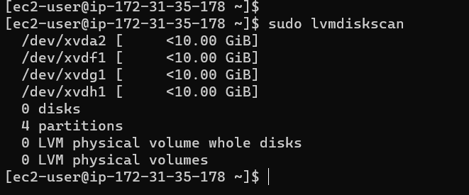

- Use *pvcreate* utility to mark each of 3 disks as physical volumes (PVs) to be used by LVM

`sudo pvcreate /dev/xvdf1 /dev/xvdg1 /dev/xvdh1`

Then confirm the PVs have been created using `sudo pvs`

- Use vgcreate utility to add all 3 PVs to a volume group (VG). Name the VG *webdata-vg*
```
sudo vgcreate webdata-vg /dev/xvdf1 /dev/xvdg1 /dev/xvdh1

sudo vgs
```
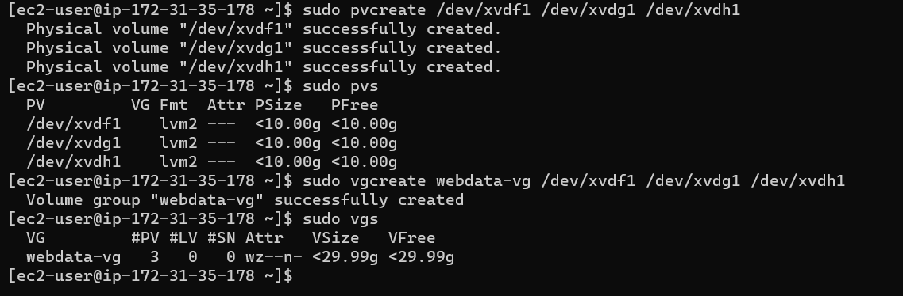

- Use the "lvcreate" utility to create 2 LV (apps-lv and apps-lv)
	- apps-lv : for storing data for the Website
	- logs-lv : for storing data for logs
``` shell
sudo lvcreate -n apps-lv -L 14G webdata-vg

sudo lvcreate -n logs-lv -L 14G webdata-vg
```
to confirm the LVs `sudo lvs`

- Use "mkfs.ext4" to format the logical volumes with ext4 filesystem
```
sudo mkfs -t ext4 /dev/webdata-vg/apps-lv

sudo mkfs -t ext4 /dev/webdata-vg/logs-lv
```

- Create /var/www/html directory to store website files

`sudo mkdir -p /var/www/html`

- Create /home/recovery/logs to store backup of log data

`sudo mkdir -p /home/recovery/logs`

- Mount /var/www/html on apps-lv logical volume

`sudo mount /dev/webdata-vg/apps-lv /var/www/html/`

- Use rsync utility to backup all the files in the log directory /var/log into /home/recovery/logs (This is required before mounting the file system)

`sudo rsync -av /var/log/. /home/recovery/logs/`

- Mount /var/log on logs-lv logical volume.

`sudo mount /dev/webdata-vg/logs-lv /var/log`

- Restore log files back into /var/log directory

`sudo rsync -av /home/recovery/logs/. /var/log`

- Update /etc/fstab file so that the mount configuration will persist after restart of the server.
``` shell
sudo blkid
sudo vi /etc/fstab
```
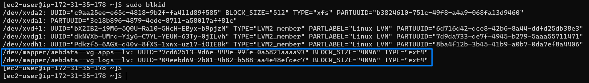

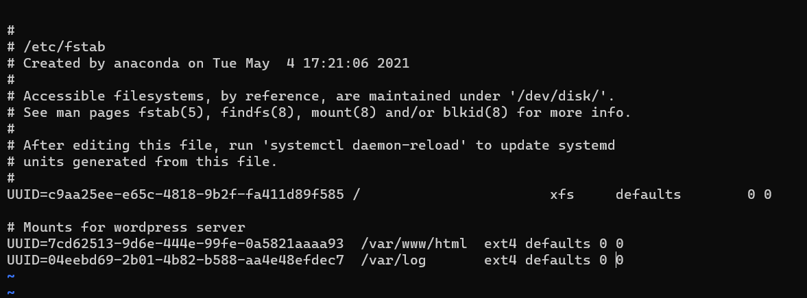

- Tested the configuration and reloaded the daemon
``` shell
sudo mount -a
sudo systemctl daemon-reload
```
- Verify your setup by running *df -h*
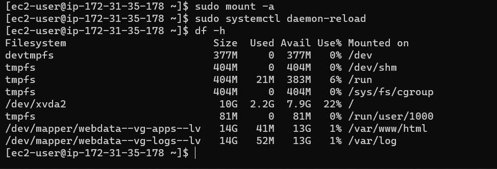

## Step 2 — Prepare the Database Server
Now for the DB Server, we created 3 EBS volume in the same AZ as the Database Sever

We attached each of the EBS volume to the DB server and connect to the server

- Update the db server packages
``` shell
sudo yum update -y
sudo su
```
- Create the partitions
``` shell
lsblk
gdisk /dev/xvdf
gdisk /dev/xvdg
gdisk /dev/xvdh
```
- Create the volume group, logical volume and format the filesystem
``` shell
sudo yum install lvm2 -y
sudo vgcreate db-vg /dev/xvdf1 /dev/xvdg1 /dev/xvdh1
sudo lvcreate -n db-lv -L 14G db-vg
sudo mkfs -t ext4 /dev/db-vg/db-lv

sudo lvcreate -n logs-lv -L 14G db-vg
sudo mkfs -t ext4 /dev/db-vg/logs-lv

sudo mkdir /db
sudo mkdir -p /home/recovery/logs
sudo mount /dev/db-vg/db-lv /db
sudo rsync -av /var/log/. /home/recovery/logs/
sudo mount /dev/db-vg/logs-lv /var/log
sudo rsync -av /home/recovery/logs/. /var/log
```

- Configure the partition to startup automatically
``` shell
sudo vi /etc/fstab
sudo mount -a
sudo systemctl daemon-reload
df -h
```
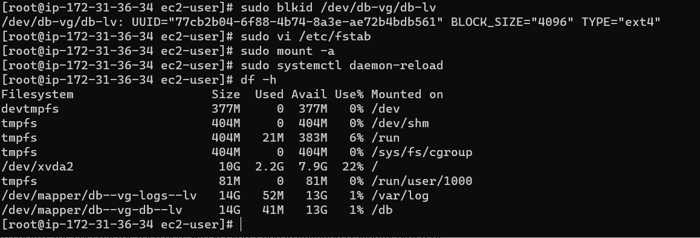

## Step 3 — Install the Web Service on the Web Server
- Install Apache and other dependencies 
``` shell
sudo yum -y update
sudo yum -y install wget httpd php php-mysqlnd php-fpm php-json
sudo systemctl enable httpd
sudo systemctl start httpd
```

- Install PHP and its dependencies
``` shell
sudo yum install https://dl.fedoraproject.org/pub/epel/epel-release-latest-8.noarch.rpm -y
sudo yum install yum-utils http://rpms.remirepo.net/enterprise/remi-release-8.rpm -y
sudo yum module list php
sudo yum module reset php
sudo yum module enable php:remi-7.4
sudo yum install php php-opcache php-gd php-curl php-mysqlnd
sudo systemctl start php-fpm
sudo systemctl enable php-fpm
sudo setsebool -P httpd_execmem 1
```
- Restart Apache

`sudo systemctl restart httpd`

- Download wordpress and copy wordpress to var/www/html
``` shell
mkdir wordpress && cd wordpress
sudo wget http://wordpress.org/latest.tar.gz
sudo tar xzvf latest.tar.gz
sudo rm -rf latest.tar.gz
cp wordpress/wp-config-sample.php wordpress/wp-config.php
cp -R wordpress /var/www/html/
```

- Configure SELinux Policies for the wordpress installation
``` shell
sudo chown -R apache:apache /var/www/html/wordpress
sudo chcon -t httpd_sys_rw_content_t /var/www/html/wordpress -R
sudo setsebool -P httpd_can_network_connect=1
```
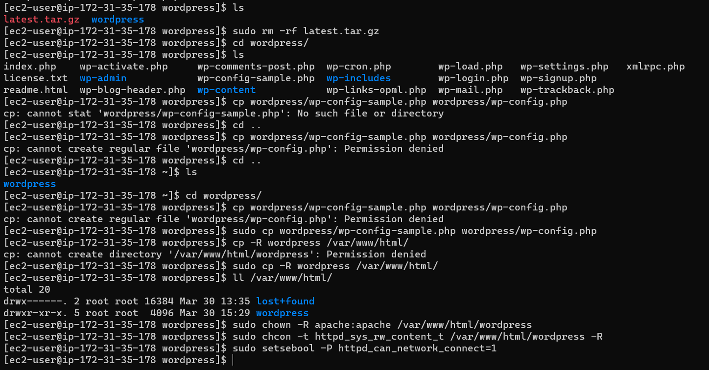

## Step 4 — Install MySQL on your DB Server EC2
- Verify that the service is up and running by using sudo systemctl status mysqld, if it is not running, restart the service and 
enable it so it will be running even after reboot:
``` shell
sudo yum update
sudo yum install mysql-server
sudo systemctl restart mysqld
sudo systemctl enable mysqld
sudo systemctl status mysqld
```
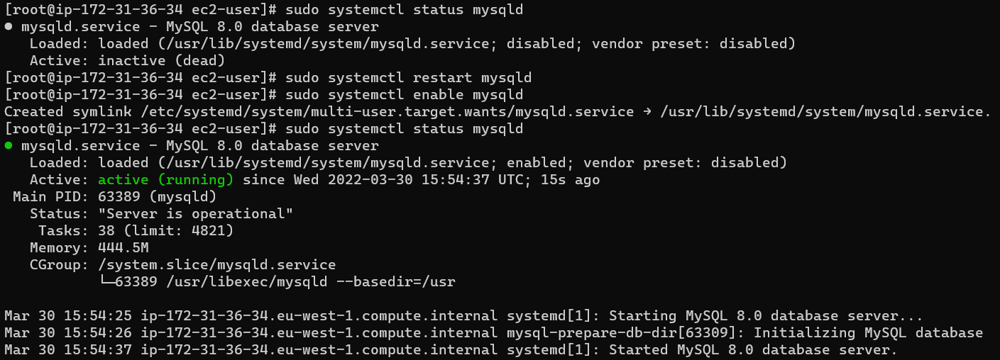

## Step 5 — Configure DB to work with WordPress
``` mysql
sudo mysql
CREATE DATABASE wordpress;
CREATE USER `nathaniel`@`172.31.35.178` IDENTIFIED BY 'GT89SCRYHP5SU';
GRANT ALL ON wordpress.* TO `nathaniel`@`172.31.35.178`;
FLUSH PRIVILEGES;
SHOW DATABASES;
exit
```
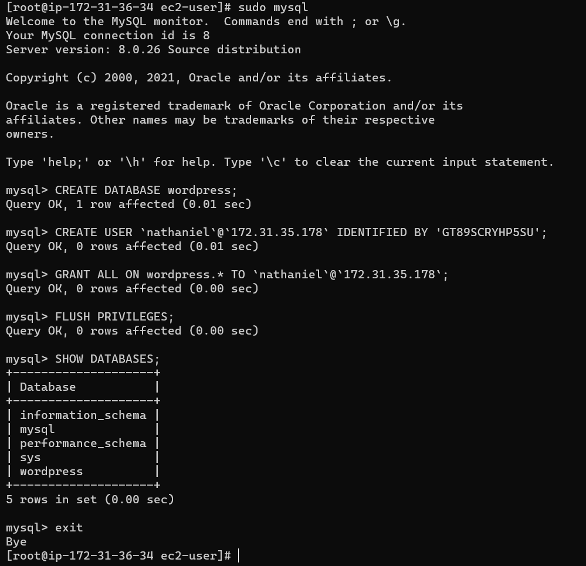

## Step 6 — Configure WordPress to connect to remote database.
-  open MySQL port 3306 on DB Server EC2. For extra security, you should allow access to the DB server ONLY from your Web 
Server’s IP address, so in the Inbound Rule configuration specify source as */32*

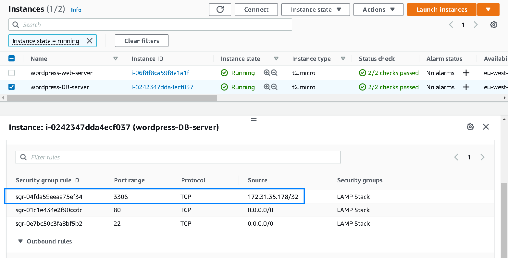

- Install MySQL client and test that you can connect from your Web Server to your DB server by using mysql-client
``` shell 
sudo yum install mysql
sudo mysql -u nathaniel -p -h 172.31.35.178`
```
- Run the simple query 
``` mysql
show databases;
```
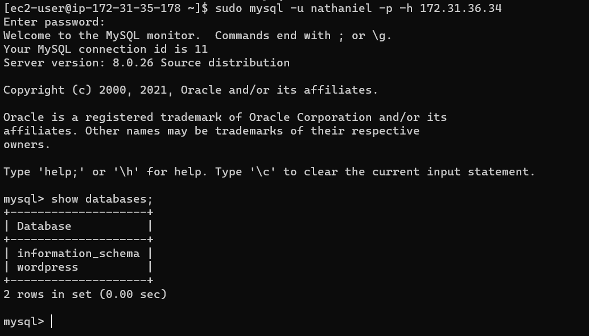

- From the Web Server EC2, edit the wp-config.php file to pupoluatre the DB information

`vi /var/www/html/wordpress/wp-config.php`

``` php
// ** Database settings - You can get this info from your web host ** //
/** The name of the database for WordPress */
define( 'DB_NAME', 'wordpress' );

/** Database username */
define( 'DB_USER', 'nathaniel' );

/** Database password */
define( 'DB_PASSWORD', 'GT89SCRYHP5SU' );

/** Database hostname */
define( 'DB_HOST', '172.31.36.34' );

/** Database charset to use in creating database tables. */
define( 'DB_CHARSET', 'utf8' );

/** The database collate type. Don't change this if in doubt. */
define( 'DB_COLLATE', '' );
```
NB: This was the user we created in the DB that was granted permission to the wordpress DB created

- Navigate to the web browser to complete the wordpress installation

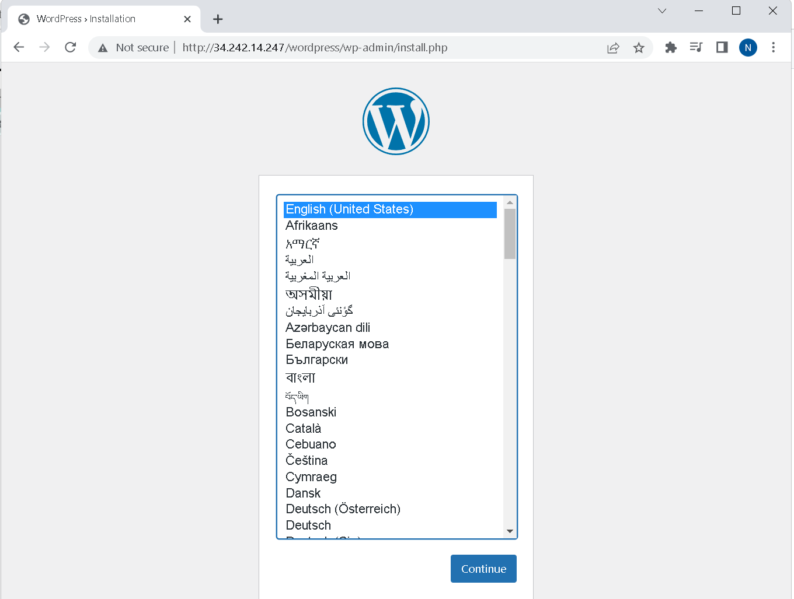

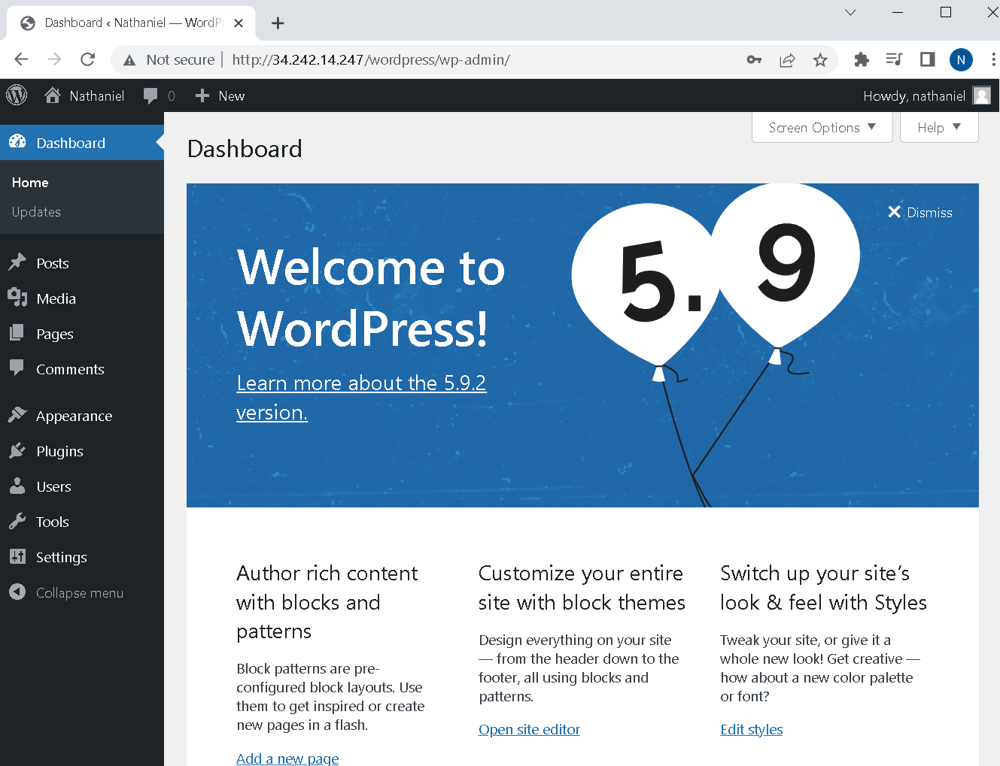
