# Project7 - Devops Tooling Website Solution

## Architecture
In this project the following tiers were utilized for the servers:
- WebServer Tier - 172.31.16.0/20
- DBServer Tier - 172.31.32.0/20
- NFS Server Tier - 172.31.0.0/20

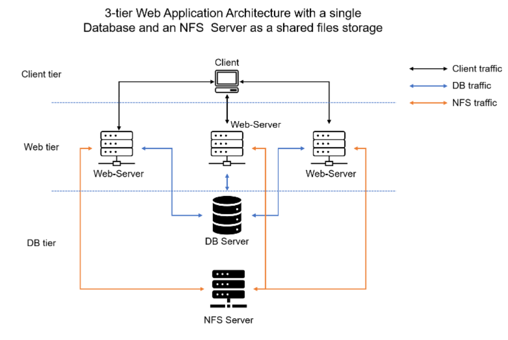

## Step 1 – Prepare NFS Server
- Launch the NFS Server Storage Instance and attach 3 EBS Volumes
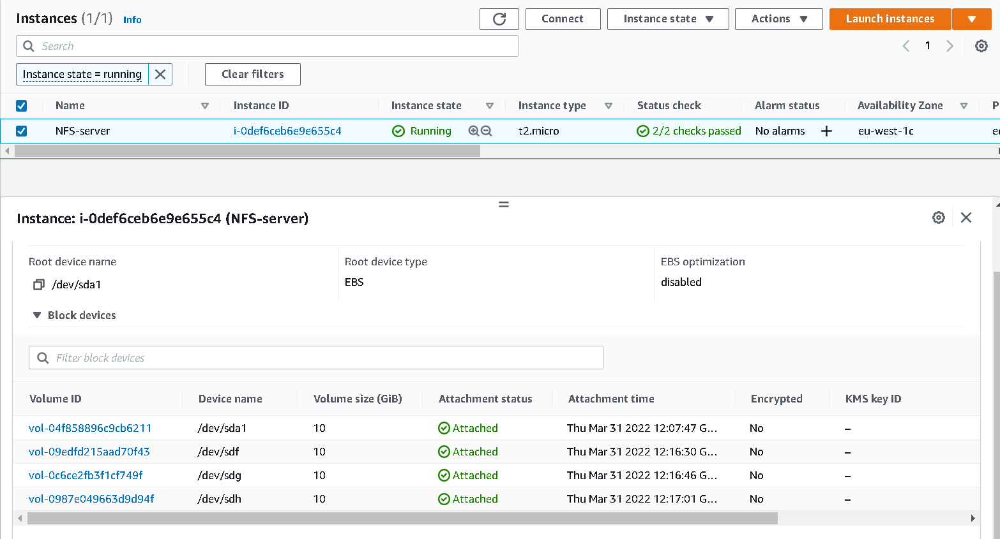

- Connect to the server and create LVM on the NFS server disk
``` shell
sudo yum update -y
lsblk
sudo su
gdisk /dev/xvdf 
gdisk /dev/xvdg
gdisk /dev/xvdh
```
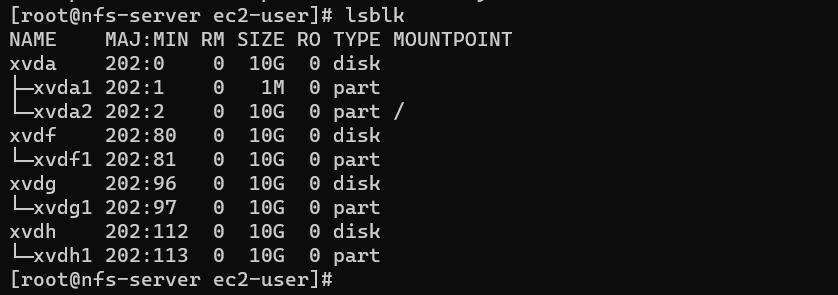

``` shell
yum install lvm2 -y
vgcreate nfs-vg /dev/xvdf1 /dev/xvdg1 /dev/xvdh1
lvcreate -n lv-apps -L 10G nfs-vg
lvcreate -n lv-logs -L 10G nfs-vg
lvcreate -n lv-opt -L 9G nfs-vg
df -h
```

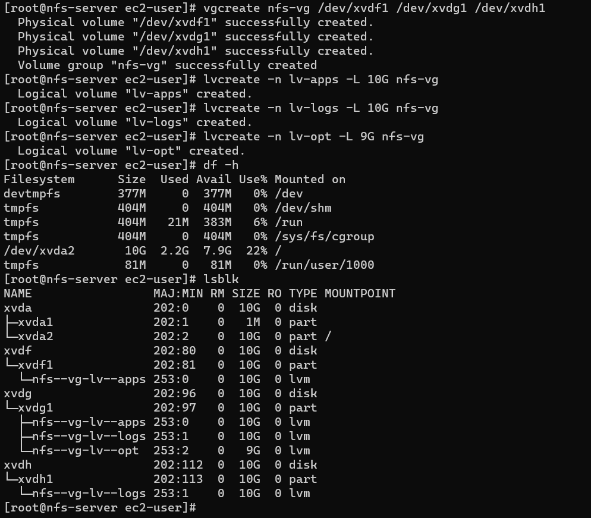

- Format the filesystem for the lvm volumes
``` shell
mkfs -t xfs /dev/nfs-vg/lv-apps
mkfs -t xfs /dev/nfs-vg/lv-logs
mkfs -t xfs /dev/nfs-vg/lv-opt
blkid
```

- Set the file system to automount on startup
``` shell
vi /etc/fstab
mkdir -p /mnt/apps
mkdir -p /mnt/logs
mkdir -p /mnt/opt
cat /etc/fstab
mount -a
df -h
```

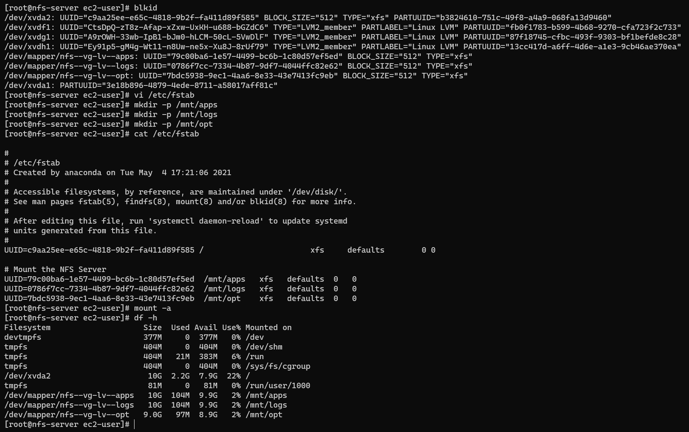

- Install NFS-Server, configure it to start on reboot and make sure it is up and running
``` shell
sudo yum -y update
sudo yum install nfs-utils -y
sudo systemctl start nfs-server.service
sudo systemctl enable nfs-server.service
sudo systemctl status nfs-server.service
```
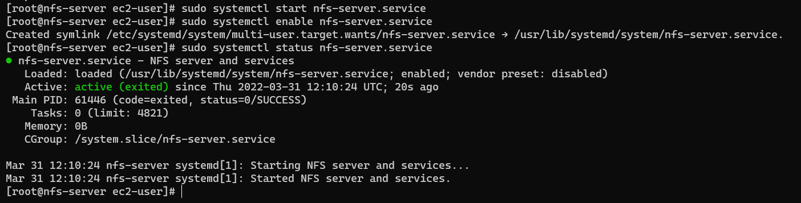

- Export the mounts for webservers’ subnet cidr to connect as clients
Set up permission that will allow our Web servers to read, write and execute files on NFS:
``` shell
sudo chown -R nobody: /mnt/apps
sudo chown -R nobody: /mnt/logs
sudo chown -R nobody: /mnt/opt

sudo chmod -R 777 /mnt/apps
sudo chmod -R 777 /mnt/logs
sudo chmod -R 777 /mnt/opt

sudo systemctl restart nfs-server.service
```

Set up the file exports to allow access from the web server subnet (172.31.16.0/20
``` shell
sudo vi /etc/exports
/mnt/apps 172.31.16.0/20(rw,sync,no_all_squash,no_root_squash)
/mnt/logs 172.31.16.0/20(rw,sync,no_all_squash,no_root_squash)
/mnt/opt 172.31.16.0/20(rw,sync,no_all_squash,no_root_squash)
sudo exportfs -arv
```
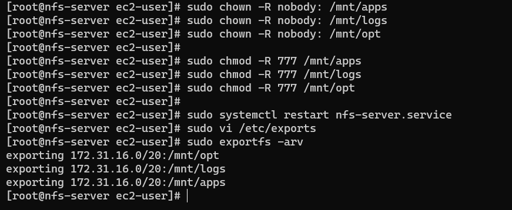

- Check which port is used by NFS and open it using Security Groups (add new Inbound Rule)
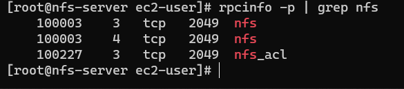

Important note: In order for NFS server to be accessible from your client, you must also open following ports: 
TCP 111, UDP 111, UDP 2049

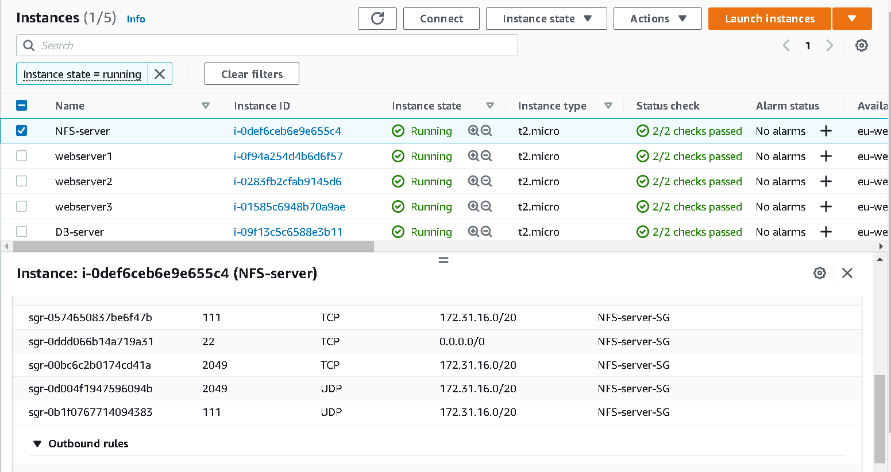

## Step 2 – Configure the Database Server
- Launch the Database instance on AWS 

- Install MySQL server
``` shell
sudo apt update -y
sudo apt install mysql-server -y
sudo systemctl start mysql.service
sudo systemctl status mysql.service
```
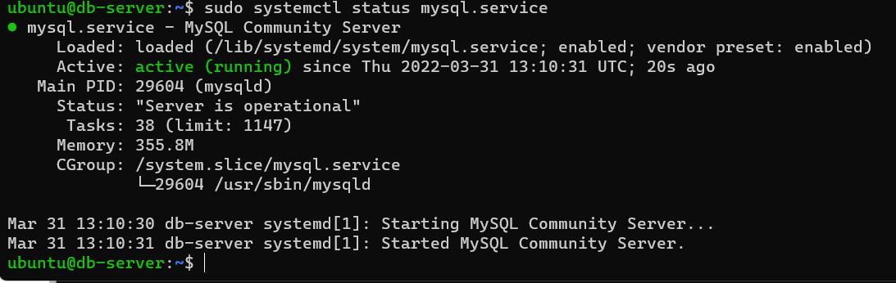

- Configure and Secure MySql Service
``` shell
sudo mysql_secure_installation -p 'MySQLr00tPASSword'
```
- Create the database and user access from webservers
``` mysql
sudo mysql
CREATE DATABASE tooling;
CREATE USER `webaccess`@`172.31.16.0/255.255.240.0`IDENTIFIED WITH mysql_native_password BY 'NaTHan13L';
GRANT ALL ON tooling.* TO 'webaccess'@`172.31.16.0/255.255.240.0`;
FLUSH PRIVILEGES;
SHOW DATABASES;
exit
```
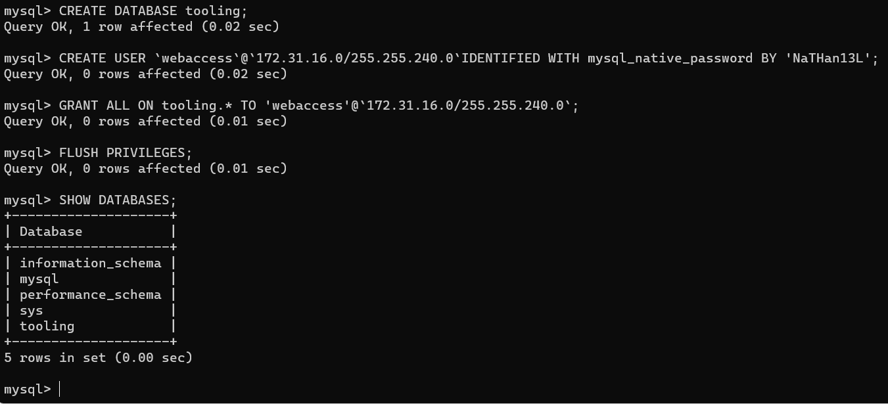

- Replace the mysql-server bind address from localhost to allow connections from remote hosts:
```
sudo sed -i 's/127.0.0.1/0.0.0.0/g' /etc/mysql/mysql.conf.d/mysqld.cnf

sudo systemctl restart mysql
```

## Step 3 — Prepare the Web Servers
- Launch a new EC2 instance with RHEL 8 Operating System

- Install NFS client

`sudo yum install nfs-utils nfs4-acl-tools -y`

- Verify connectivity to NFS server

`rpcinfo -p 172.31.12.254 | grep nfs`

- Mount /var/www/ and target the NFS server’s export for apps
``` shell
sudo mkdir /var/www
sudo mount -t nfs -o rw,nosuid 172.31.12.254:/mnt/apps /var/www
```
- Verify that NFS was mounted successfully by running df -h. Make sure that the changes will persist on Web Server after reboot:
``` shell
sudo vi /etc/fstab
```
Then add the following lines
```
172.31.12.254:/mnt/apps /var/www        nfs defaults 0 0
172.31.12.254:/mnt/logs /var/log/httpd  nfs defaults 0 0
```
- Install Remi’s repository, Apache and PHP
``` shell
sudo yum install httpd -y
sudo dnf install https://dl.fedoraproject.org/pub/epel/epel-release-latest-8.noarch.rpm -y
sudo dnf install dnf-utils http://rpms.remirepo.net/enterprise/remi-release-8.rpm -y
sudo dnf module reset php -y
sudo dnf module enable php:remi-7.4 -y
sudo dnf install php php-opcache php-gd php-curl php-mysqlnd -y
sudo systemctl start php-fpm
sudo systemctl enable php-fpm
sudo setsebool -P httpd_execmem 1
```
- Run `sudo mount -a` to complete the mount
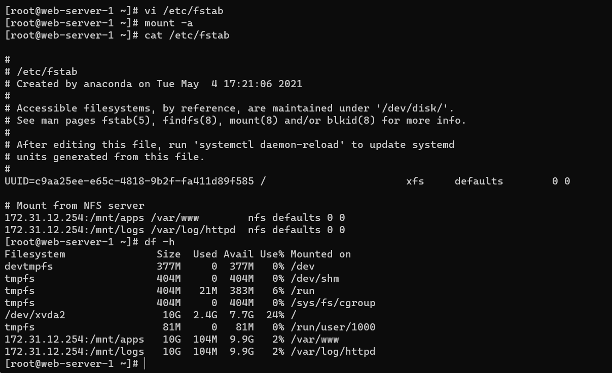

- Repeat the steps above for another 2 Web Servers.

- Clone the required repository and copy the html folder 
``` shell
sudo yum install git -y
git clone https://github.com/amadinathaniel/tooling.git
cd tooling
cp -r html/. /var/www/html
```
- Open TCP port 80 on the Web Server Security Group if not open already.

- Modify the mysql connection details in the php file - /var/www/html/functions.php to look like this:
``` php
$db = mysqli_connect('172.31.45.156', 'webaccess', 'NaTHan13L', 'tooling', '3306');
```

- Configure SELinux to permit the httpd service to use NFS
```
sudo setsebool -P httpd_use_nfs
``` shell

- Configure SELinux to permit the httpd service to utilize /usr/sbin/php-fpm service to connect to the db
``` shell
sudo setsebool -P httpd_can_network_connect_db 1
```
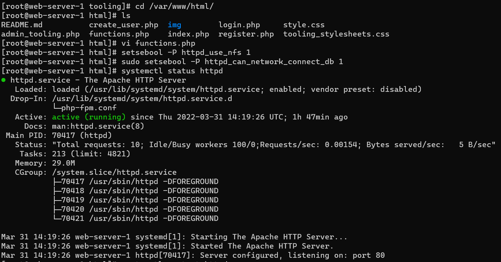

- Create in MySQL a new admin user with username: myuser and password: password:
``` mysql
sudo yum install mysql -y
mysql -h 172.31.45.156 -u webaccess -p  < tooling-db.sql

INSERT INTO users (id, username, password, email, user_type, status) 
VALUES(2, "myuser", "5f4dcc3b5aa765d61d8327deb882cf99", "user@mail.com", "admin", "1");
```
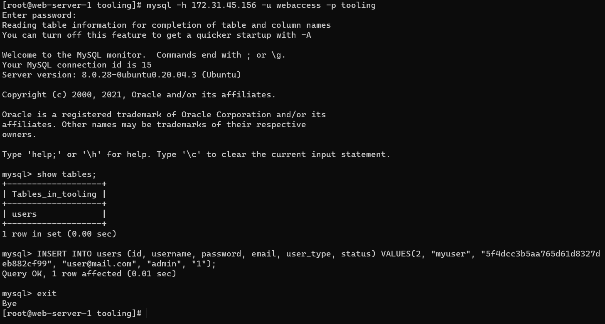

- Verify that you can access the webpage

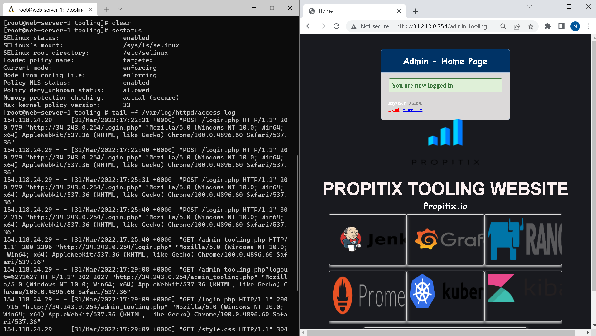
