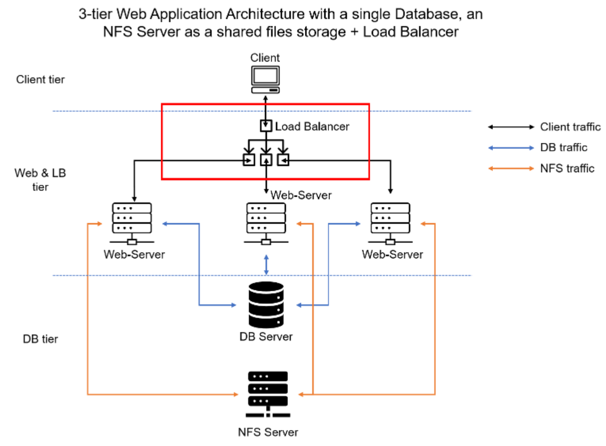
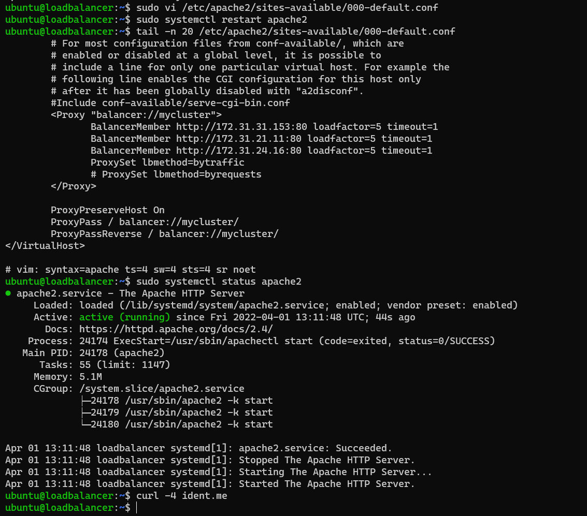
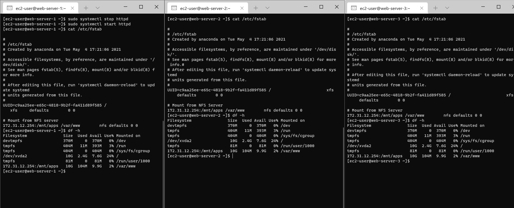
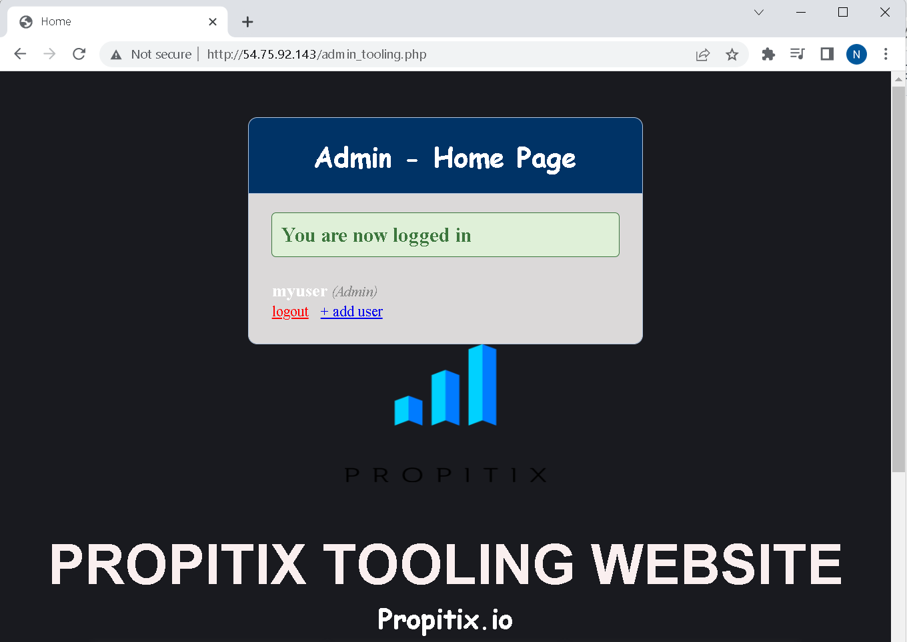
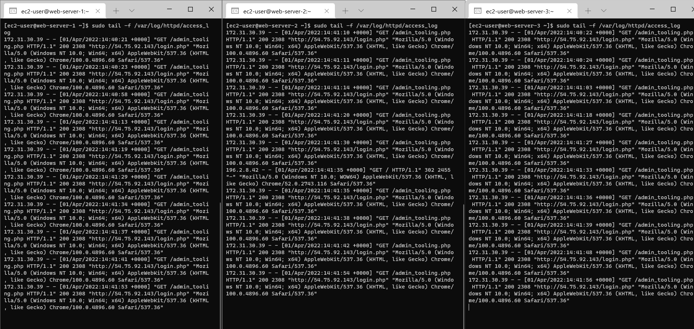
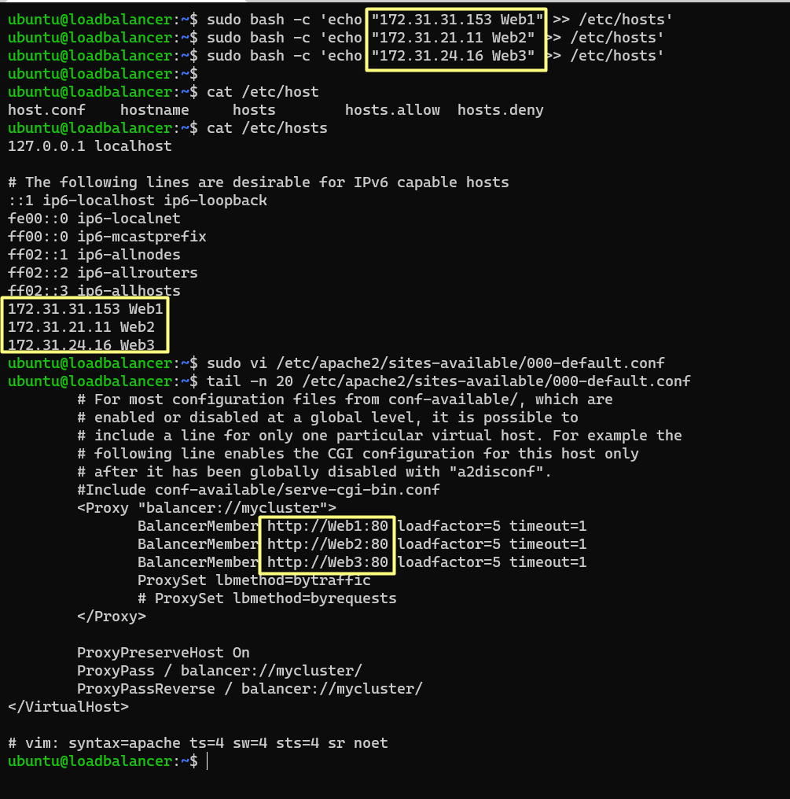
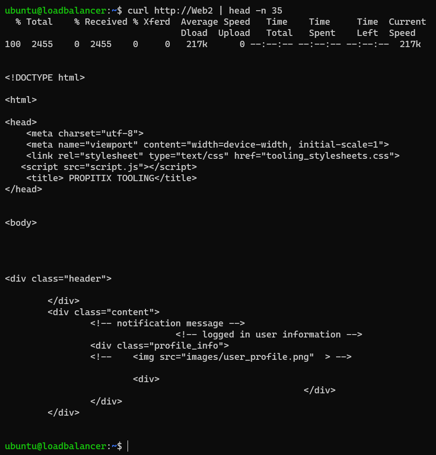

# Project 8 - Load Balancer Solution With Apache

## Architecture
In this project, we are utilizing the servers implemented in [Project 7](../Project-7/project7.md) and including a load balancer solution using Apache



## Step 1 - Install Apache on the load balancing Instance
- Launch a new ec2 instance and install apache
```
sudo apt update
sudo apt install apache2 -y
sudo apt-get install libxml2-dev -y
```
- Enable following apache modules to configure load balancer:
```
sudo a2enmod rewrite
sudo a2enmod proxy
sudo a2enmod proxy_balancer
sudo a2enmod proxy_http
sudo a2enmod headers
sudo a2enmod lbmethod_bytraffic
```
- Restart apache2 service
```
sudo systemctl restart apache2
sudo systemctl status apache2
```
- Configure load balancing
Include the Proxy configuration in the site configuration section <VirtualHost *:80>
```
sudo vi /etc/apache2/sites-available/000-default.conf

#Add this configuration into this section <VirtualHost *:80>  </VirtualHost>

	<Proxy "balancer://mycluster">
            BalancerMember http://<WebServer1-Private-IP-Address>:80 loadfactor=5 timeout=1
            BalancerMember http://<WebServer2-Private-IP-Address>:80 loadfactor=5 timeout=1
			BalancerMember http://<WebServer2-Private-IP-Address>:80 loadfactor=5 timeout=1
            ProxySet lbmethod=bytraffic
            # ProxySet lbmethod=byrequests
    </Proxy>

    ProxyPreserveHost On
    ProxyPass / balancer://mycluster/
    ProxyPassReverse / balancer://mycluster/

#Restart apache server

sudo systemctl restart apache2
```


- Unmount the log directory from the webservers to ensure their logs can be read individually in case of troubleshooting.
Remove /var/log/httpd line from /etc/fstab and confirm its not mounted
```
sudo vi /etc/fstab
sudo umount -a
sudo mount -a
```


- Verify that load balancing works by accessing the load balancer site


- Check that each server receives logs in when the load balancer IP Address is refreshed


## Optional Step – Configure Local DNS Names Resolution
- Add the IP addresses of the Web server to the host file to configure load DNS Name Resolution on the Load balancer
```
sudo bash -c 'echo "172.31.31.153 Web1" >> /etc/hosts'
sudo bash -c 'echo "172.31.21.11 Web2" >> /etc/hosts'
sudo bash -c 'echo "172.31.24.16 Web3" >> /etc/hosts'
```

- Update the site configuration with the DNS Name


- Verify that Local DNS works


- Restart apache2 service
```
sudo systemctl restart apache2
```


