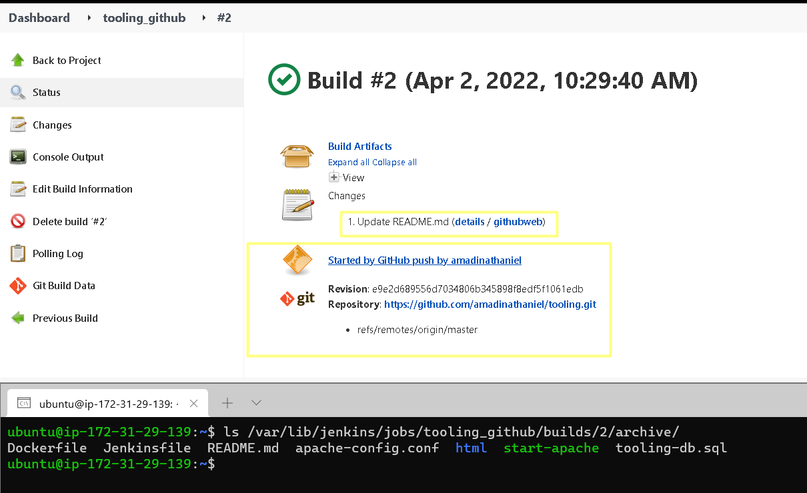

# Project 9 - Continous Integration Pipeline For Tooling Website

## Architecture
In this project, we are utilizing the servers implemented in [Project 7](../Project-7/project7.md) and configuring a CI Pipeline 
to trigger a Jenkins build when changes are observed on the github repository.


## Step 1 – Install Jenkins server
- Create an AWS EC2 server based on Ubuntu Server 20.04 LTS and name it "Jenkins"
``` shell
# Install JDK (since Jenkins is a Java-based application)
sudo apt update
sudo apt install default-jdk-headless -y

# Install Jenkins
wget -q -O - https://pkg.jenkins.io/debian-stable/jenkins.io.key | sudo apt-key add -
sudo sh -c 'echo deb https://pkg.jenkins.io/debian-stable binary/ > \
    /etc/apt/sources.list.d/jenkins.list'
sudo apt update
sudo apt-get install jenkins -y

# Check if Jenkins is running
sudo systemctl status jenkins
```

- By default Jenkins server uses TCP port 8080 – open it by creating a new Inbound Rule in your EC2 Security Group


- Complete the Initial Jenkins setup


## Step 2 – Configure Jenkins to retrieve source codes from GitHub using Webhooks
- Enable webhooks in your GitHub repository settings 
Note that Public IP used for Jenkins server is not an elastic IP hence the IP addresses vary.


## Step 3 - Create a Jenkins Freestyle Project
- Go to Jenkins web console, click "New Item" and create a "Freestyle project"
- To connect your GitHub repository, you will need to provide its URL, you can copy from the repository itself


- Archive the build artifacts of the Github files


- Run a Jenkins job to test:


- Trigger Jenkins to poll Github using webhook configured earlier


- Now, go ahead and make some change in any file in your GitHub repository (e.g. README.MD file) 
and push the changes to the master branch.

- A new build has been launched **automatically** (by webhook) and you can see its results – artifacts, saved on Jenkins server.
By default, the artifacts are stored on Jenkins server locally



## Step 4 – Configure Jenkins to copy files to NFS server via SSH
- Install "Publish Over SSH" plugin.


- Configure the job/project to copy artifacts over to NFS server
Navigate to `Manage Jenkins > Configure System > "Publish Over SSH"` configuration Section.


- Open your Jenkins job/project configuration page and add another one "Post-build Action" -> "Send build artifacts over SSH"

 

- Configure it to send all files produced by the build into our previously defined remote directory. 
In our case we want to copy all files and directories – so we use `**`


## Step 5 - Make a change to the github repo to trigger a Jenkins Build
- For example, add the line `(c) Nathan Amadi` at the end of the read me file.


Then after build, confirm that artifacts were successfully transferred using the command below on the NFS server:

```
tail -n 5 /mnt/apps/README.md
``` 

Note: Please ensure proper permissions are set on `/mnt/apps` folder for user defined on jenkins.
 

